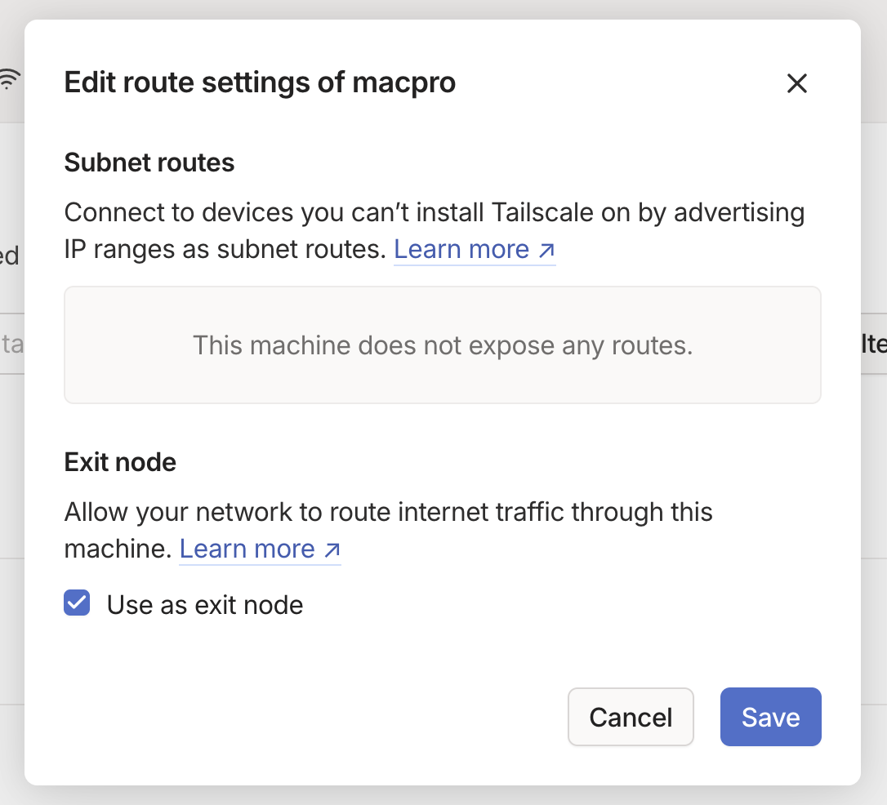
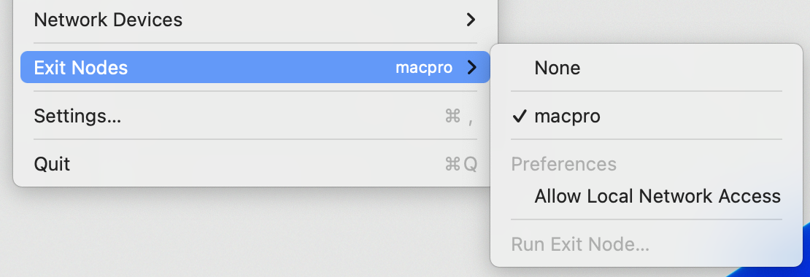

# TailscaleでExit Nodeを設定する

TailscaleにはExit Nodeと呼ばれる機能がある。これは文字通り、Tailscaleネットワーク内のExit Nodeを介してすべての通信を行えるというものである。

## 環境

今回は自宅サーバー(Ubuntu)を出口ノードとする。

- Mac Pro (Ubuntu 22.04): 出口ノード
- MacBook Pro (macOS 13.6): クライアントノード

## セットアップ

基本的には[ドキュメント](https://tailscale.com/kb/1103/exit-nodes)に従えば良い。

まずはサーバー側の設定。IPパケットフォワーディングを有効化する。

```
$ echo 'net.ipv4.ip_forward = 1' | sudo tee -a /etc/sysctl.d/99-tailscale.conf
$ echo 'net.ipv6.conf.all.forwarding = 1' | sudo tee -a /etc/sysctl.d/99-tailscale.conf
$ sudo sysctl -p /etc/sysctl.d/99-tailscale.conf
```

`--advertise-exit-node`オプションとともに、`tailscale up`を実行。

```
$ sudo tailscale up --advertise-exit-node
```

UDP GRO forwardingというのを有効化したほうがいいと言われるが、今回は簡単のため無視する。

次に、Admin consoleのMachinesから、サーバーの"Edit route settings..."を開き、"Use as exit node"を有効にする。



これで、サーバーを出口ノードとして使えるようになる。

あとは、クライアント側で出口ノードを選択すれば、すべての通信が設定した出口ノードを経由するようになる。



## 参考

- [Exit nodes (route all traffic) · Tailscale Docs](https://tailscale.com/kb/1103/exit-nodes)
- [Performance best practices · Tailscale Docs](https://tailscale.com/kb/1320/performance-best-practices#ethtool-configuration)