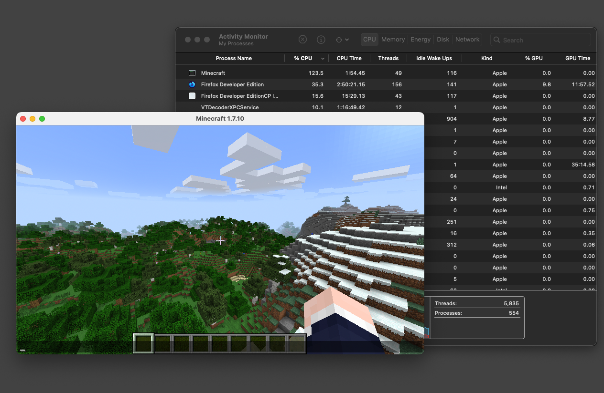
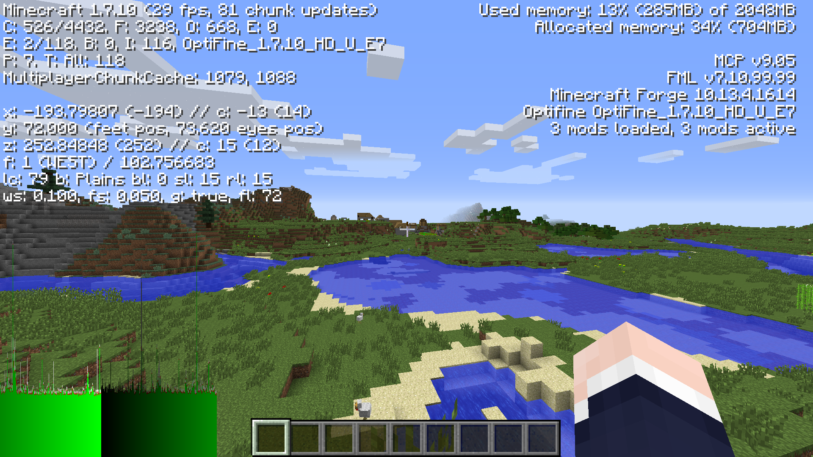
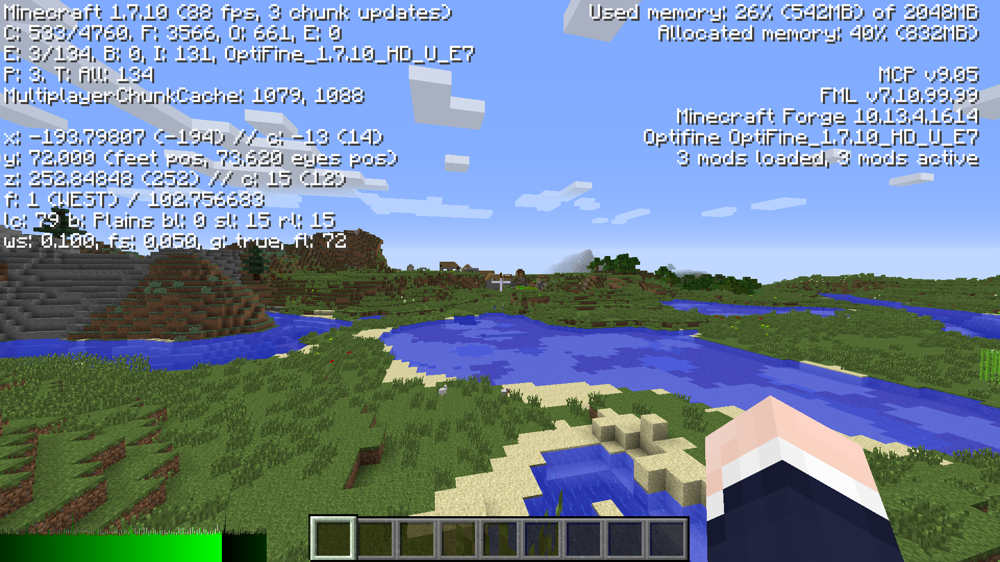

# Minecraft 1.7.10をApple Siliconでネイティブに動かす

MinecraftのJava版は、バージョン1.19以降でApple Siliconにネイティブ対応しています。そして、それ以前にリリースされたバージョンは、一応Rosetta 2による互換で起動することができるので、Apple Siliconで遊べないというわけではありません。

しかし、これはネイティブ実行ではないので、パフォーマンスが幾分か低下してしまいます。古いバージョンでは特に、著しくFPSが下がります。

古い依存ライブラリを取り替えることで、1.7.10のような古いMinecraftでもApple Siliconでネイティブに動かすことができたので、その方法を紹介します。1.7.10以外でも、LWJGL 2を使っているバージョンであれば同じようにできるかと思います。

## バニラの場合

### Javaランタイム

Minecraftランチャーに同梱のJavaランタイム(JRE)は、x86_64のものであるため、arm64版のJavaランタイムを別途インストールします。ディストリビューションはAdoptiumなど何でも良いのですが、arm64(aarch64)のものを選びます。

※Forgeも使うという場合は、後述の理由により[Zulu JDK](https://www.azul.com/downloads/?version=java-8-lts&os=macos&architecture=arm-64-bit#zulu)などが良いです。

### client.json

client.jsonというのは、Minecraftのクライアントのバージョンや、必要なライブラリが記述されているJSONファイルです。注目すべきはその中の`libraries`です。

`libraries`は依存ライブラリのリストですが、いくつかのライブラリはネイティブコードを含んでいます。例えば、LWJGLやJInputなどです。

1.7.10を含む古いMinecraftでは、これらのライブラリがx86_64にしか対応していないために、Apple Silicon上ではRosetta 2を必要とするわけです。

したがって、これらのライブラリをarm64対応のもので置き換えれば良いのです。

ただ、LWJGLを自分でビルドするのは結構大変です。丁度[Legacy Fabricの方々がforkしてくれている](https://github.com/Legacy-Fabric/lwjgl)ので、これを拝借します。

JInputについては、最新の2.0.10をそのまま使うことができました。

書き換えたclient.jsonはそれなりに長いので、GitHub Gistに置いておきました。これを、`~/Library/Application Support/minecraft/versions/1.7.10-arm64/1.7.10-arm64.json`あたりに保存すると、ランチャーに認識されるようになります。

- [client.json for MC 1.7.10, with native Apple Silicon support · GitHub](https://gist.github.com/k0michi/600b17e961a39dbc8e5a6b4d5af4c6a9)

### 起動構成の編集

ランチャーを起動して、新しい起動構成を作るか、既存の起動構成を編集します。

- "バージョン"を1.7.10-arm64に
- "JAVAのパスの指定"を、インストール済みのarm64版JREのjavaへのパスに

設定します。

これで、1.7.10をApple Siliconネイティブとして起動することができるはずです。

## Forgeの場合

Forgeの場合も同様に、新しいclient.jsonを作成します。次のGistを、`~/Library/Application Support/minecraft/versions/1.7.10-Forge10.13.4.1614-1.7.10-arm64/1.7.10-Forge10.13.4.1614-1.7.10-arm64.json`に置きます。ただし、前述の1.7.10-arm64.jsonがすでにあることが前提です。

- [1.7.10-Forge10.13.4.1614-1.7.10-arm64.json · GitHub](https://gist.github.com/k0michi/5f658f55bd067c511747f7247120b730)

起動構成も同様に作るのですが、1.7のForgeはJava 9以降には対応していないことに注意してください。つまり、macOSのarm64上で動くJava 8のJREが必要なわけですが、Adoptiumなどのメジャーどころは提供していません。Zulu JDKなど、他のディストリビューションを使う必要が出てきます。

- [Java 8, 11, 17, 21, 23 Download for Linux, Windows and macOS](https://www.azul.com/downloads/?version=java-8-lts&os=macos&architecture=arm-64-bit#zulu)

## どれくらい速くなるの？

ここまで、古いMinecraftをApple Siliconネイティブで動かすための手間をかけたわけですが、一体どれくらいFPSが上がるのでしょうか。

一言で言うなら、「劇的に」変わる、といっても過言ではないと思います。Forgeの場合では、起動画面の段階で目に見えて速くなりますし、プレイ中はバニラでもForgeでも、相当FPSが上がります。

OptiFine E7, 描画距離16チャンク, Fancy設定, 1920x1080, Apple M1 Proで、Rosetta 2を使った場合では、これしかFPSが出ません。

Apple Siliconネイティブにすることで、だいたい2〜3倍のFPSが出るようになります。

新しめのMacで10年前のMinecraftをやりたいという(私のような)奇特な方々は、ぜひ参考にしてみてくださいね。