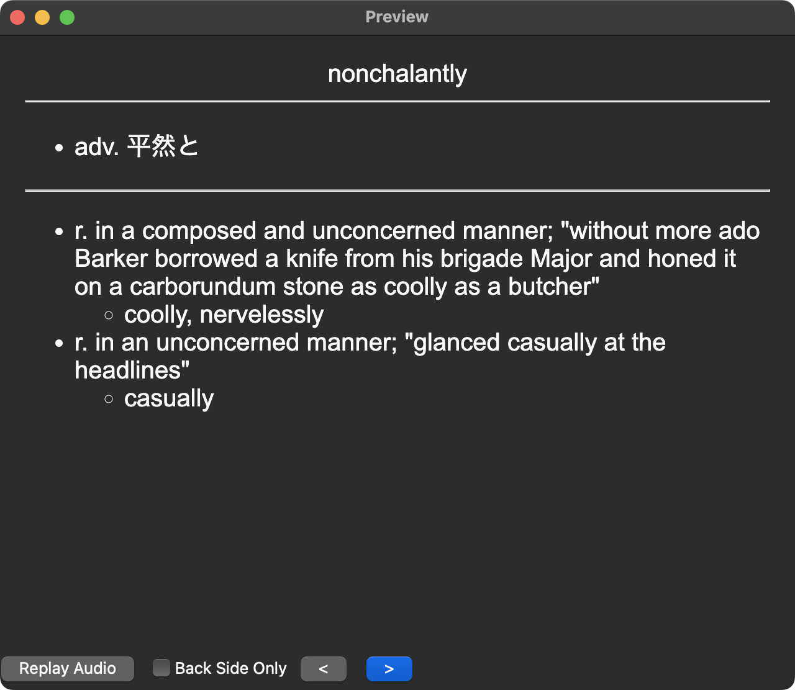

# 英語版WordNetを使って、単語カードに英英辞典+シソーラスを追加する

[WordNet](https://wordnet.princeton.edu/)とは、プリンストン大学が公開しているフリーな英単語データベースです。WordNetには、このオリジナルの英語版に加えて[日本語版](https://bond-lab.github.io/wnja/)も存在しますが、今回扱うのはオリジナルの英語版WordNet 3.1です。

このWordNet 3.1なのですが、日本語版とは異なり独自のプレーンテキスト形式として公開されています。そのため、これを使うためには何らかのライブラリが必要となります(もちろん、自分で作ることも可能です)。公式でもフロントエンドを用意しているようですが、今回は使いません。

今回は、このWordNet 3.1をJavaScriptから利用して、既存の単語カードに対して、英語による語義の説明とシソーラス(類語)を追加してみます。

## WordNet 3.1のダウンロード

[Current Version](https://wordnet.princeton.edu/download/current-version)のページからWordNet 3.1 Databaseをダウンロードし、展開します。

## node-wordnetのインストール

WordNet 3.1を扱うためのJavaScriptライブラリとして、[node-wordnet](https://github.com/morungos/wordnet)があります。このnode-wordnetはnpmにも上がっていますが、そっちは古いままなのでGitHubから開発ブランチを持ってきます。

```
$ pnpm add https://github.com/morungos/wordnet
```

## node-wordnetの使い方

node-wordnetの基本的な使い方の例は次のとおりです。

```js
import WordNet from 'node-wordnet';

const wordnet = new WordNet({
  dataDir: 'data/dict' // WordNetのディレクトリを指定
});
await wordnet.open();

// 見出し後を検索する
const senses = await wordnet.lookup('word');

// 品詞を指定する場合
// const senses = await wordnet.lookup('word#n');

// sensesを用いた処理...

await wordnet.close();
```

`wordnet.lookup()`の結果は次のようなオブジェクトの配列になっています。

```js
[
  {
    synsetOffset: 6686933,
    lexFilenum: 10,
    pos: 'n',
    wCnt: 5,
    lemma: 'password',
    synonyms: [ 'password', 'watchword', 'word', 'parole', 'countersign' ],
    lexId: '0',
    ptrs: [
      {
        pointerSymbol: '@',
        synsetOffset: 6898439,
        pos: 'n',
        sourceTarget: '0000'
      },
      {
        pointerSymbol: '@',
        synsetOffset: 6685698,
        pos: 'n',
        sourceTarget: '0000'
      }
    ],
    gloss: 'a secret word or phrase known only to a restricted group; "he forgot the password"  ',
    def: 'a secret word or phrase known only to a restricted group',
    exp: [ 'he forgot the password' ]
  }
]
```

- `pos`: 単語の品詞
  - `n`: 名詞
  - `v`: 動詞
  - `a`: 形容詞
  - `r`: 副詞
  - `s`: 形容詞(adjective satellite)
- `synonyms`: 同義語
- `gloss`: 語義&例文
- `def`: 語義
- `exp`: 例文

という構造になっています。

## 単語カードに情報を加える

与えられた単語に対して、その単語の語義と類語をHTMLとして返す処理を作ります。

```js
import { escape } from 'html-escaper';

/**
 * @param {string} word 
 * @returns {string}
 */
async function getSynonymsAsHTML(word) {
  const senses = await wordnet.lookup(word);

  if (!senses) {
    return '';
  }

  let result = '<ul>';

  for (const s of senses) {
    result += '<li>';
    result += `${s.pos}. ${escape(s.gloss)}`;
    const synonyms = s.synonyms.filter(sy => sy != word);
    if (synonyms.length > 0) {
      result += `<ul><li>${synonyms.join(', ')}</li></ul>`
    }
    result += '</li>'
  }

  result += '</ul>';
  return result;
}
```

このHTMLを既存の単語カードの変換処理に付け加えます。これにより、次のように単語カードにWordNetの情報を付け加えることができます(罫線よりも下がWordNet、上は既存の単語カード)。



## node-wordnetの不具合&フォーク

このように、node-wordnetはWordNetを簡単に扱える素晴らしいライブラリなのですが、バイナリサーチの処理にバグがあり、実際には存在するにも関わらず`lookup`の結果が空になる不具合があります。

- [Binary search fix by k0michi · Pull Request #42 · morungos/wordnet · GitHub](https://github.com/morungos/wordnet/pull/42)

残念ながらこのパッケージは積極的にアップデートされていないため、いつupstreamが修正されるかは不透明です。

応急処置として、筆者が作成したフォークを使うことができます。このフォークは次のコマンドでインストールできます:

```
$ pnpm add https://github.com/k0michi/wordnet
```