# SLばんえつ物語号に乗ってきた【会津若松→新津】

会津若松に移り住んでからというものの、いつかあの「SLばんえつ物語号」に乗ろう乗ろう(一度、一駅間だけ乗ったことはある)、と思っていたのですが、時が経つのは早いもので、気づけばもうここにいられるのもあと数ヶ月。しかも、ばんえつ物語号が運行されるのは12月の半ばまで。今を逃すと、もう一生乗れるタイミングがなくなってしまうかもしれない。そう思い立って、えきねっとの予約ページを開くと、なんとグリーン車に△の表示が。ばんえつ物語号のグリーン車は席が少ない上に人気があり、前見た時はどの日程でも取れそうになかったのだ。

えきねっとで予約をしてしまう、というのも一つの選択肢ではあったのだが、ここで私は、この席が誰にも押さえられないことを祈りながら会津若松駅に向かうという暴挙に出た。えきねっとを使ったことが(ほぼ)ないため、直接出向いた方が楽に思えたためである。それに、もしグリーン席が押さえられていたとしても指定席に乗ればいいだけの話であるとも思えた。それに、本格的に冬がやってきてからでは外に出るのが億劫になるだけだから、今日しかないと思った。

12時頃に会津若松駅に到着。早速、指定席券売機に向かう。そして……。

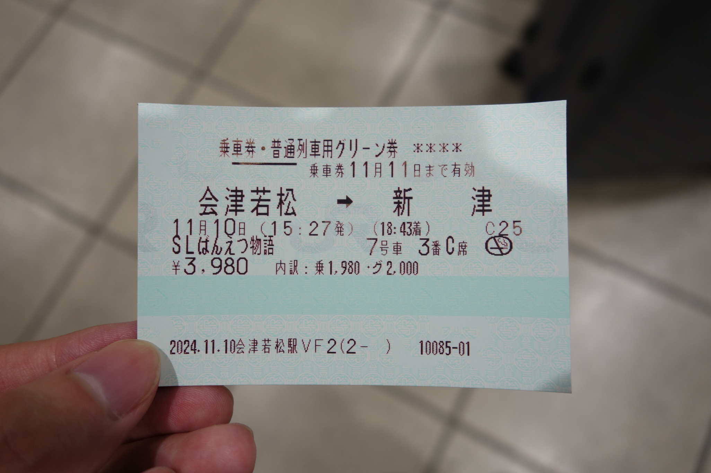

なんという奇跡だろうか、ばんえつ物語号のグリーン券を予約せずとも手に入れることができたのである。しかも、窓側の席。これは、天からの贈り物と言っても過言ではなかろう。

## 出発までの時間潰し

切符を買ったのが12時くらいだったのだが、下り列車の出発は15時半。それなりに時間があったので、昼食を食べつつ、会津若松駅の周りを散策することにした。

<figure>
  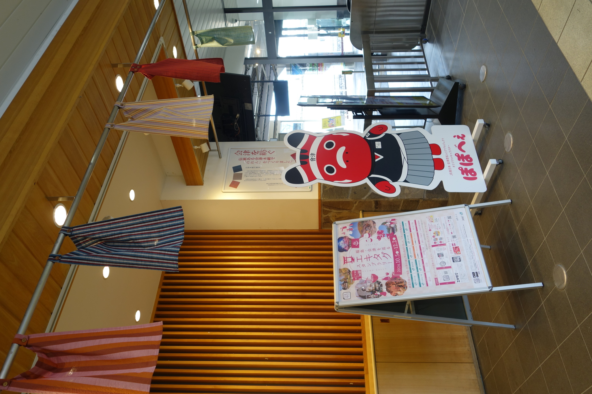
  <figcaption>
ぽぽべぇと会津木綿
</figcaption>
</figure>

<figure>
  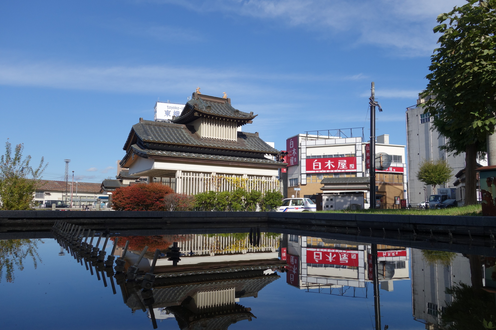
  <figcaption>
会津若松駅前の噴水。水が出ていなかった
</figcaption>
</figure>

<figure>
  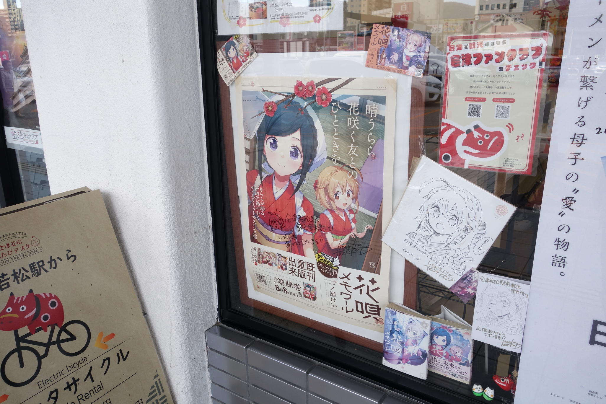
  <figcaption>
東山温泉が舞台らしい。読まねば
</figcaption>
</figure>

## 改札を通り抜けて

出発30分前頃に改札を通り抜ける。

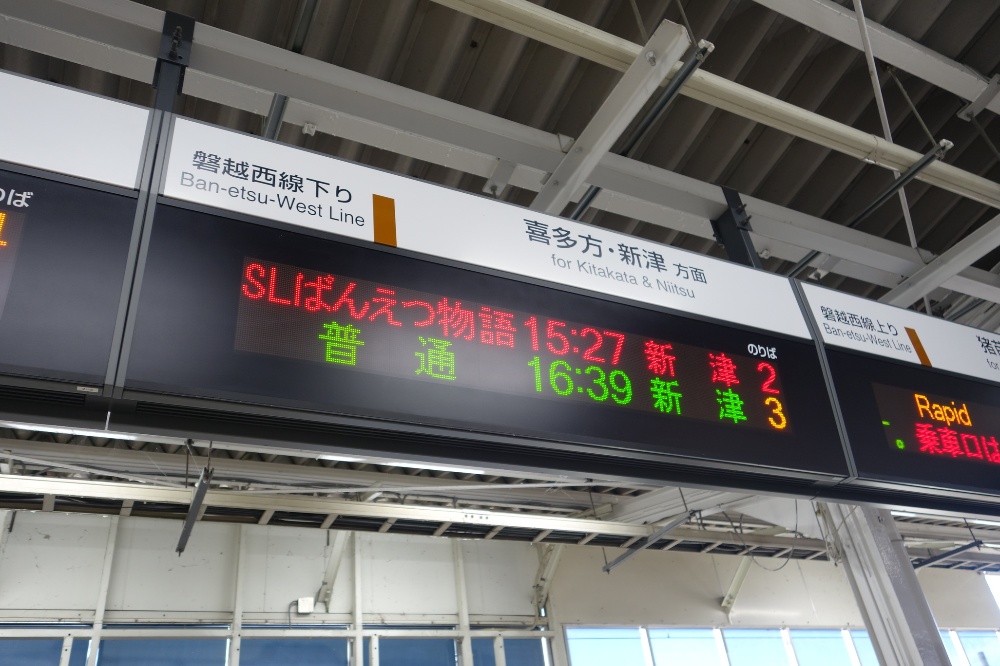

列車はまだ入線していなかった。ちょうどSLが転車台から戻ってきたところだろうか、客車と機関車の連結シーンを見ることができた。

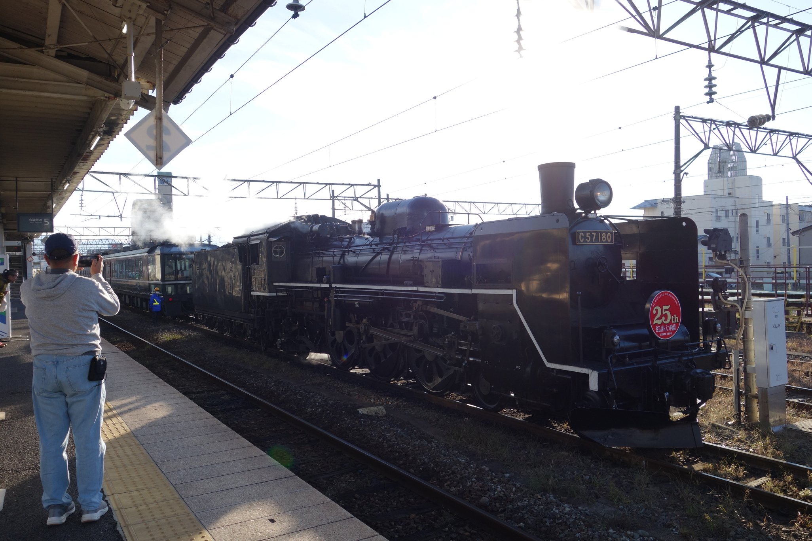

連結後、プラットフォームに入線。ヘッドマークが25周年記念のものになっている。

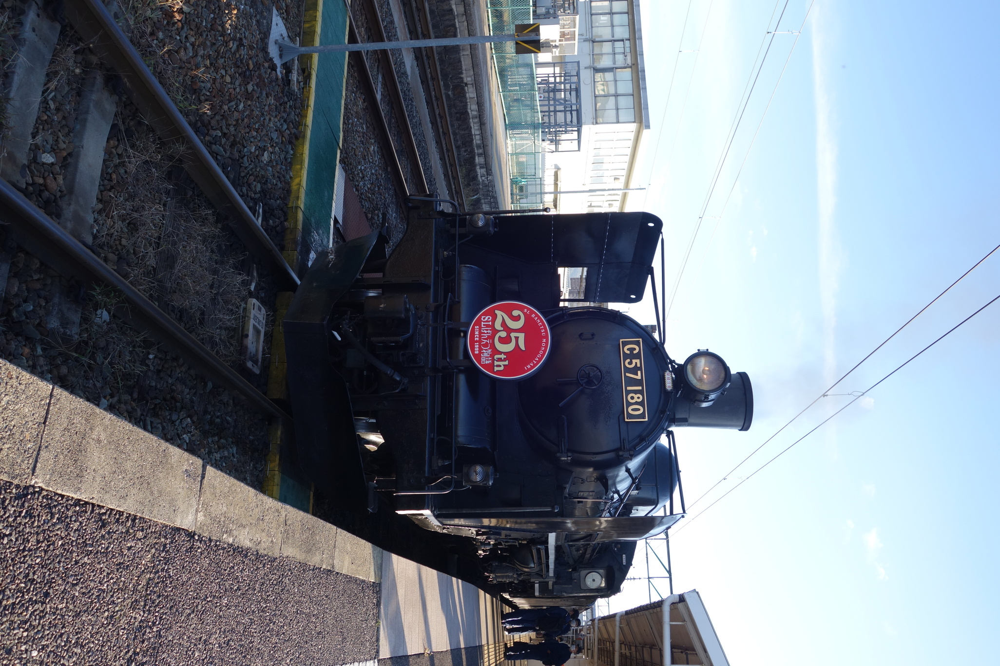

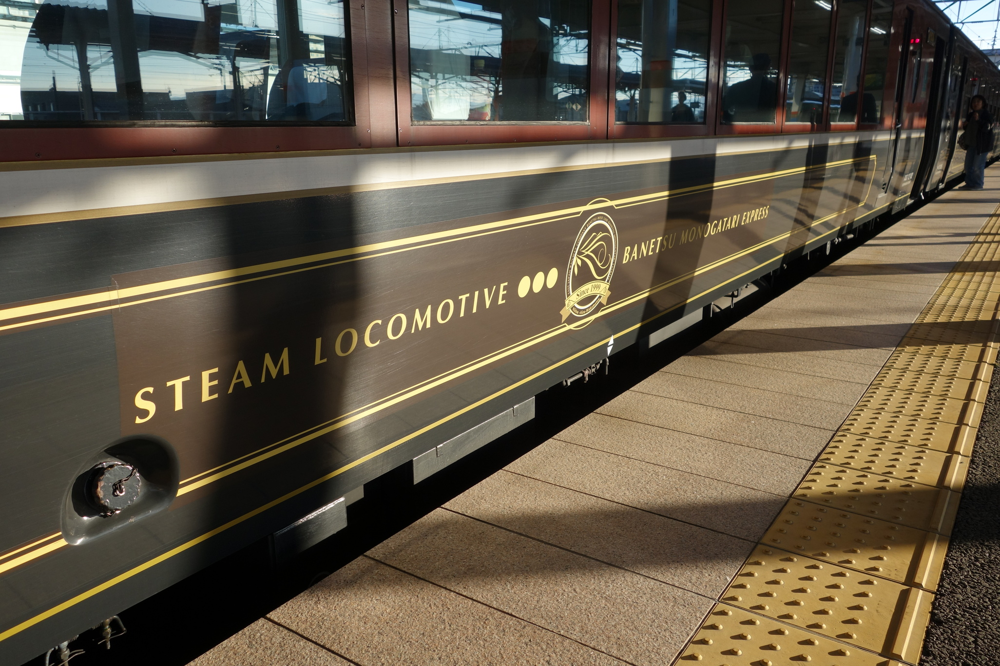

内装はグリーン車だけ特別仕様になっている。座席が全て前向きになっていて、照明にも装飾がなされている。大正浪漫を想起させる客車の装飾は、蒸気機関車にとてもよく似合っていて、蒸気機関車が現役だった時代にいるかのような気分を味わえる。

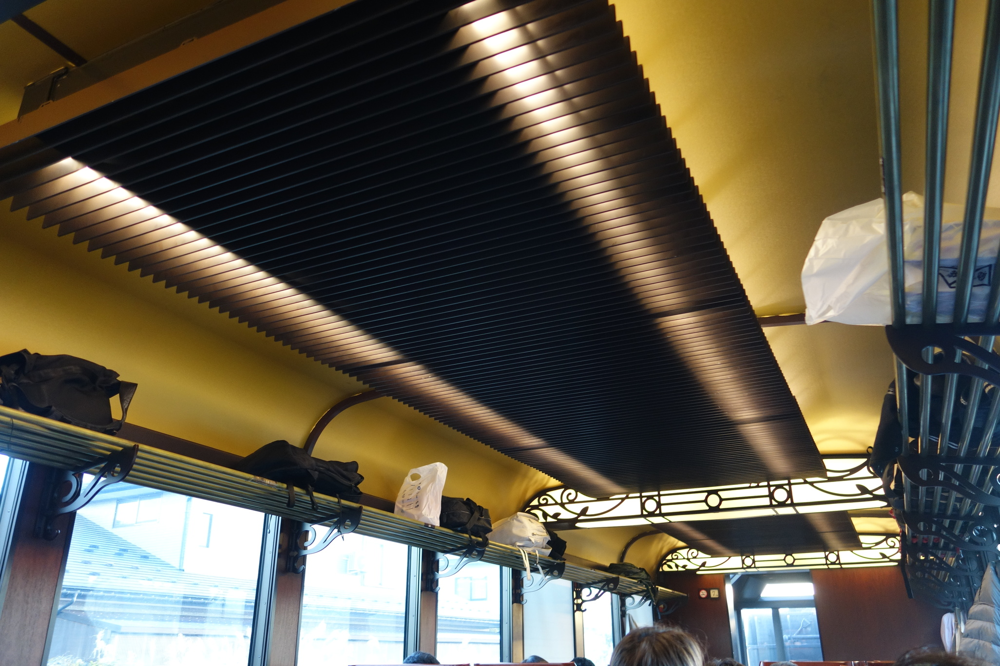

## 出発

列車が動き始めると、電車では到底感じられないような揺れが、客車を通じて自分の体に伝わってきた。速度が速くなるにつれて、立っていることすら困難になるくらいに、客車が大きく揺れるようになる。これはまさに、新幹線と対をなす乗り心地であると言え、日本の鉄道技術がここ100年でいかに進歩したのかを物語っていた。

<figure>
  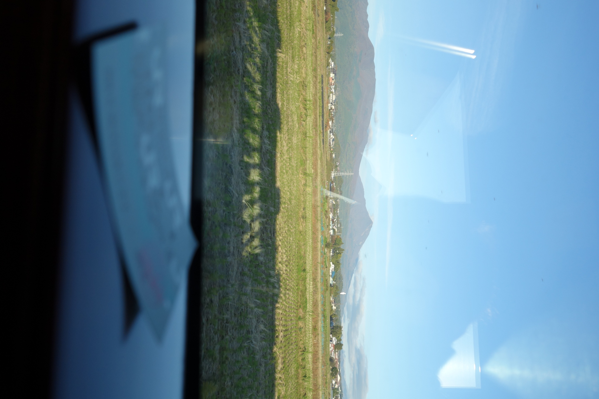
  <figcaption>
磐梯山を望む
</figcaption>
</figure>

<figure>
  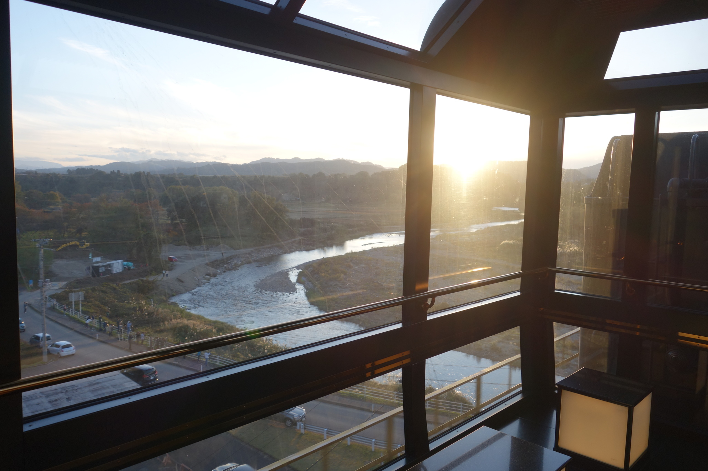
  <figcaption>
グリーン車専用の展望デッキ。夕陽に包まれゆく世界
</figcaption>
</figure>

電車と異なるのは車体の揺れだけではない。列車がトンネルに入ると、客車の隙間からか多少の煤煙が車内に入ってくるのである。これは決して人体にとって良いものではないのだろう。しかし、この匂いは、蒸気機関車に乗る醍醐味の一つと言っても過言ではない。あのどこか心地よい煤の匂いは、現代においては嗅ぐ機会がめったないものだと思う。ちなみに、このとき展望デッキは真っ白な煙に覆われて、面白い光景を拝むことができる。

## 売店

5号車には売店があり、食べ物やグッズなどを買うことができる。お腹は空いていなかったので、オコジョのストラップを購入。名前はオコジロウというらしい。

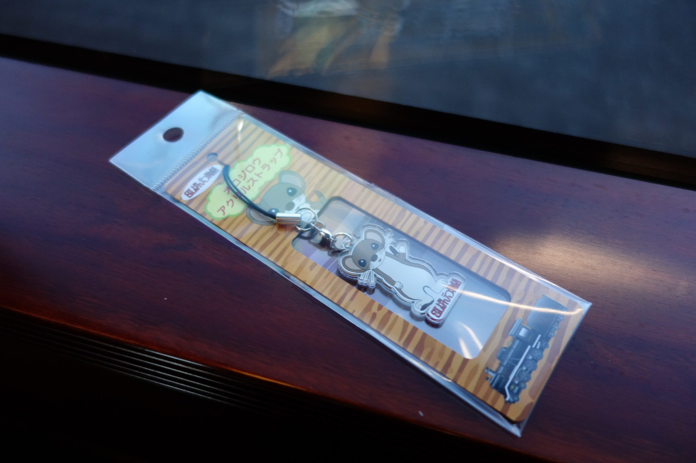

## 野沢駅での停車

会津若松駅の出発から1時間ほど経つと、野沢駅で10分ほどの停車がある。この駅は、プラットフォームの先が線路と同じ高さになっており、SLの先頭を撮影することができるようになっている。

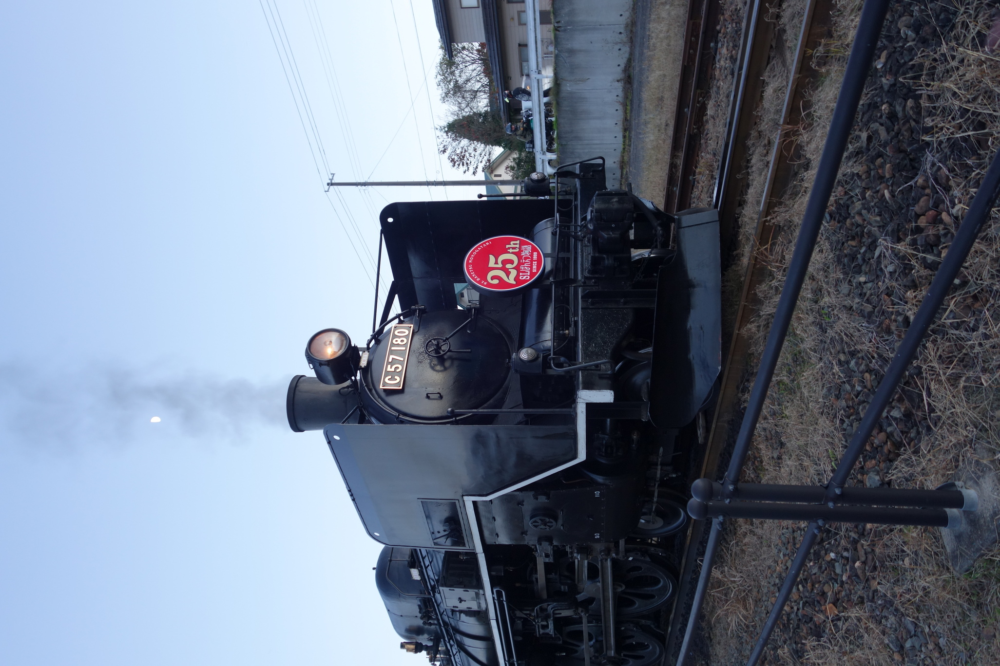

## じゃんけん大会

野沢駅を出発すると、唐突にじゃんけん大会が始まった。このじゃんけん大会というのは、車掌さんとじゃんけんをしていって、勝ち残った人は賞品がもらえるというもの。賞品は缶バッヂ。上り下りで違うデザインで、毎月デザインが変わるのだという。じゃんけん大会の賞品としてはなかなか手が込んでいる。

子供向けではあるのかもしれないが、乗客の過半数が手を上げて参加していたので、私も参加した。しかし、一回戦目であえなく撃沈。最後は勝ち残り同士での対決になるなど、なかなかに白熱したじゃんけん大会であった。

見知らぬ乗客達との一期一会な緩い接点が生まれるのも、こういう企画列車の魅力のように感じた。

じゃんけん大会が終わる頃には、日がほとんど落ち、車窓が夕闇に包まれていた。

## 津川駅での停車

津川駅でも、車両の点検として15分ほどの停車がある。すでに日は暮れていて、小さな駅なので灯りもほとんどないなかで、作業が行われる。

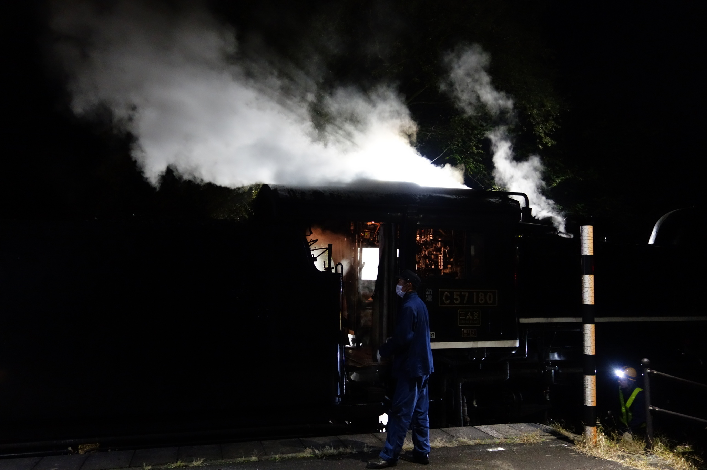

作業員の方々は、炭水車の上に登り、石炭の山を均したり、機関車の車輪の様子を見たりしていた。私はただその光景を見ているだけだったが、役目を終えて50年以上経った蒸気機関車を、今日においてもこうして整備・点検する職人たちの姿に、脱帽せざるを得なかった。

<figure>
  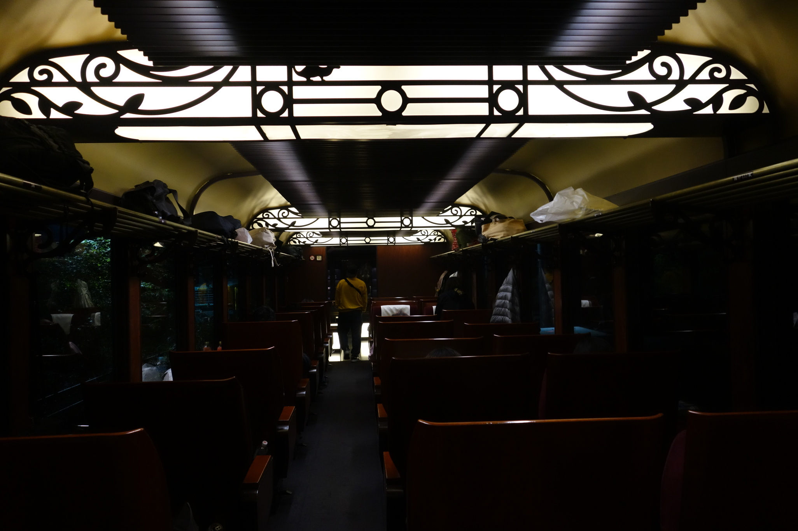
  <figcaption>
津川駅を出発する頃には、車内は薄暗く幻想的な印象を抱かせる
</figcaption>
</figure>

## 展望車

4号車は展望車になっている。といっても、私がいった頃にはすでに、窓の外は真っ暗であった。郵便ポストがあり、ここから投函することで消印がこの列車オリジナルのものになる、ということであろう。記念乗車スタンプもここで押すことができる。

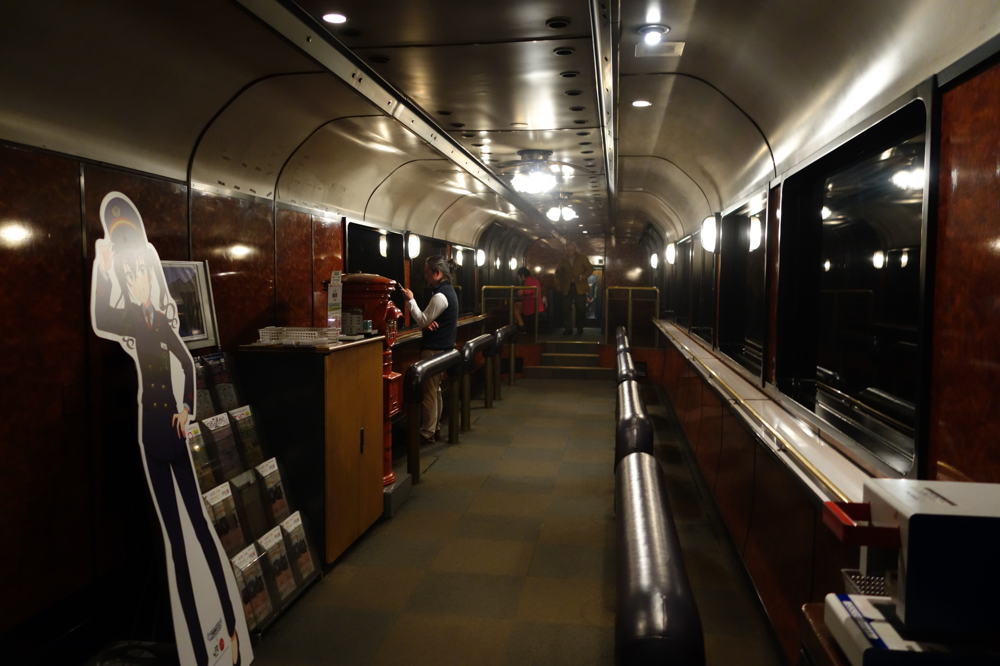

<figure>
  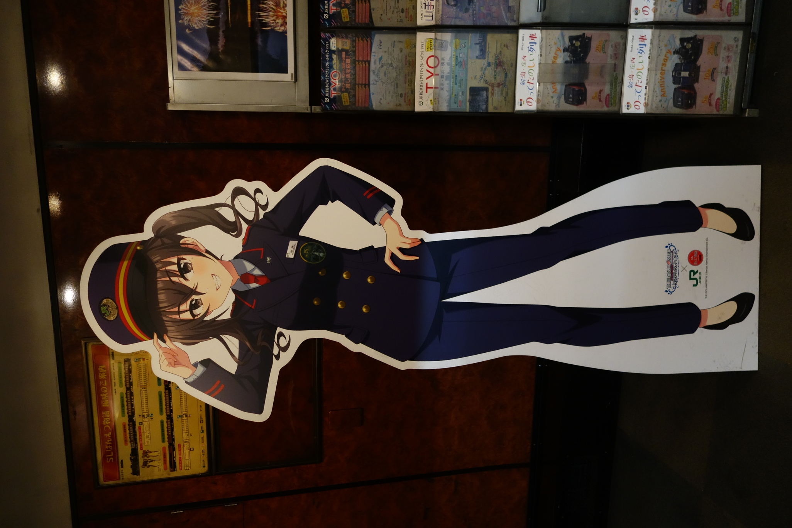
  <figcaption>
デレマスの子がいた
</figcaption>
</figure>

## 新津へ

車内を見学しているうちに、列車は新津の一つ前の停車駅、五泉駅に到着していた。五泉を発車して暫くすると、車掌さんのアナウンスがこの旅の終わりを告げる。新津は鉄道の要衝として発展した街であり、鉄道の街とも呼ばれているそうだ。実際私は、新津駅の近くでJRの車両工場があるのを目にしたことがある。

程なくして、新津駅に到着。

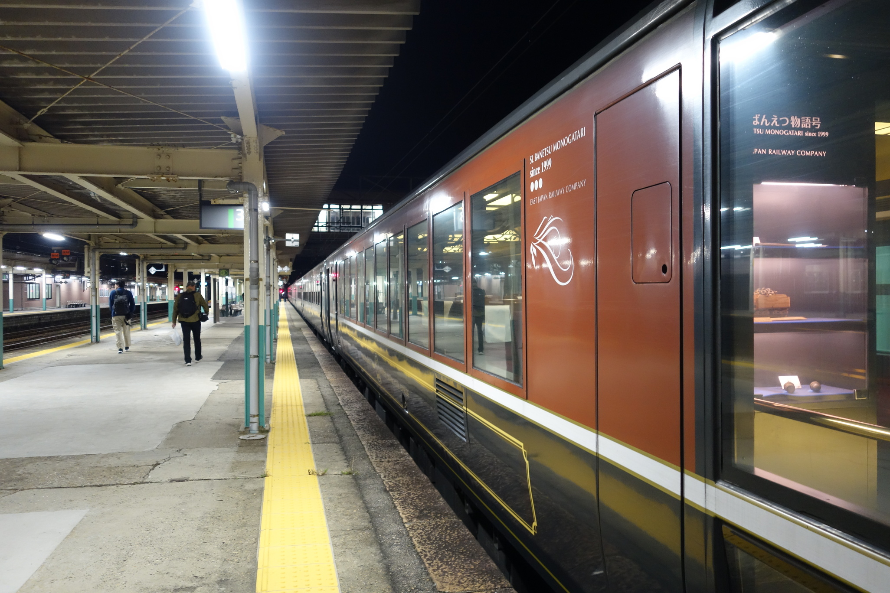

<figure>
  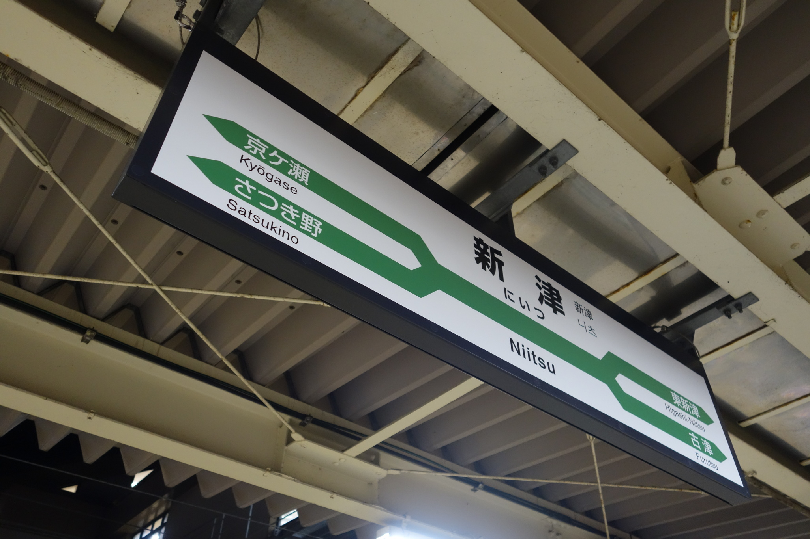
  <figcaption>
新津が鉄道の要衝であることは、この駅名標からも窺い知ることができる
</figcaption>
</figure>

## 終わりに

鉄道の速達性、利便性が重視される今日において、このような鉄道の浪漫を追求した列車というのは数を減らし続けていると思う。この理由について、鉄道会社を責めるのは簡単なことであるが、問題の本質はその方が儲かるからなのであり、それはつまり顧客がそれを求めているから、なのだと私は思う。社会が、人々が、生産性と効率を求めているのである。夢の超特急はもはや夢ではなく、それが当たり前の時代になってしまったのである。

そんな現代社会で、こうした浪漫と乗車体験にだけフォーカスを当てた列車を走らせてくれているのは、とてもありがたいことではないだろうか。かくいう私も、小さい頃は鉄道が好きだったが、ここ暫くは鉄道に乗るのは義務的で、楽しみをあまり見出せずにいた。しかしこの列車は、私にその楽しみを思い出させてくれたように思う。願わくば、札幌上野間の寝台列車が復活してはくれないだろうか——そんな夢物語に想いを馳せながら、この旅を締めくくることとする。