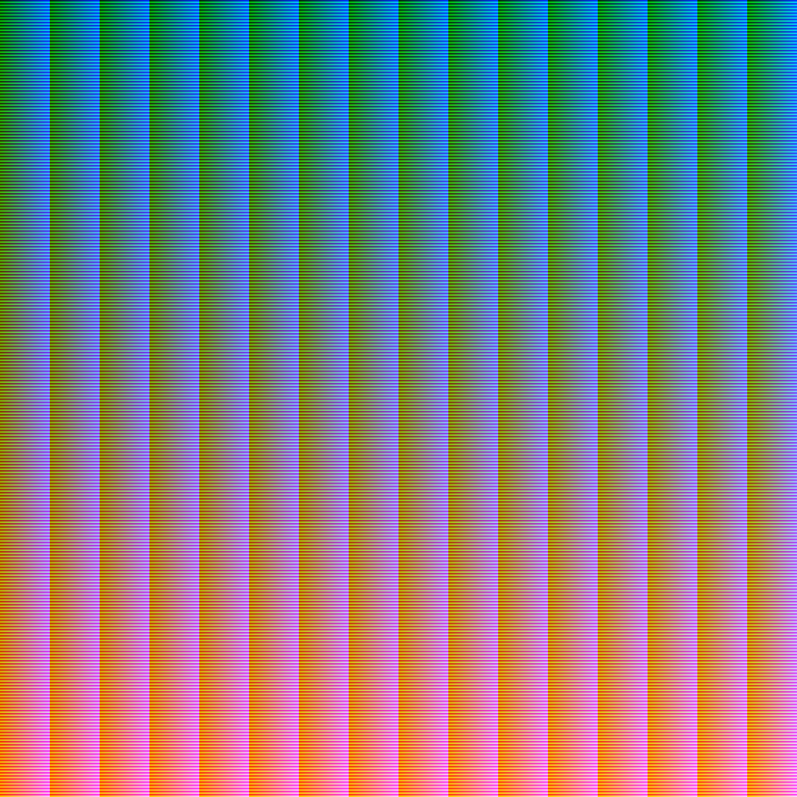
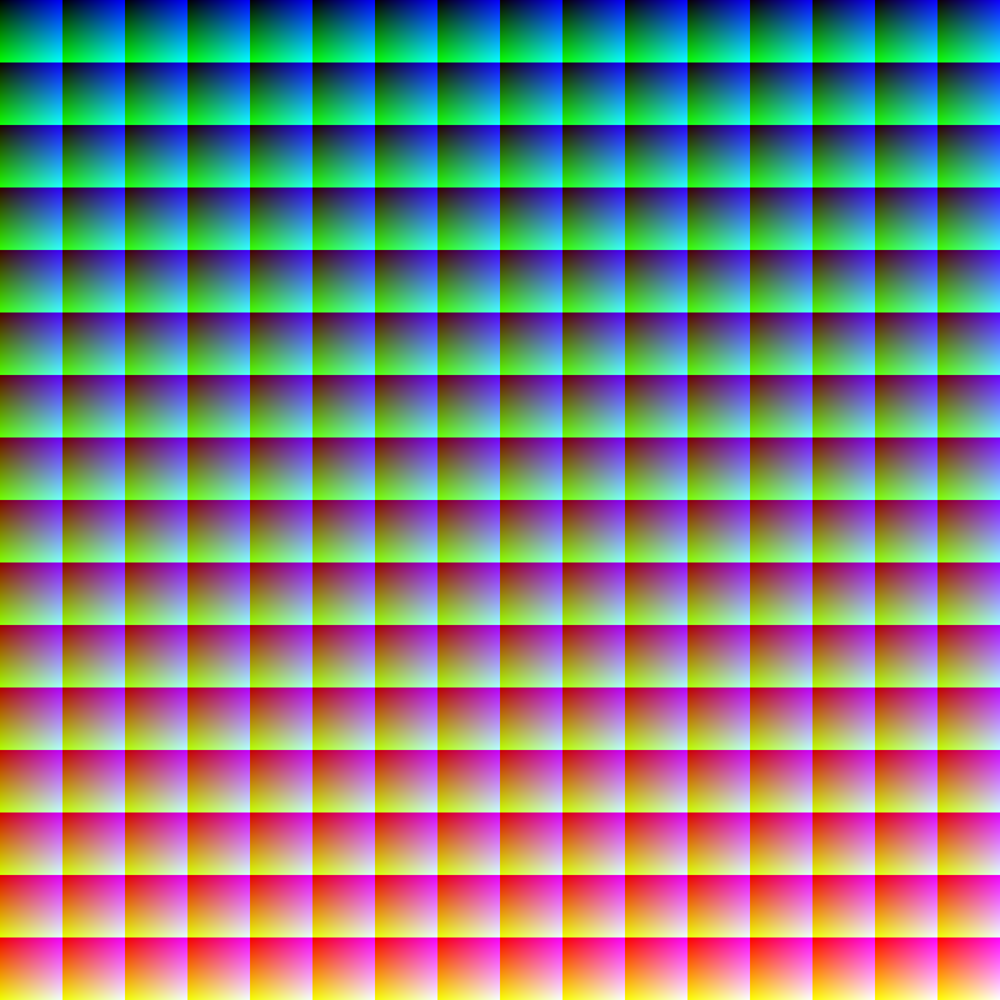
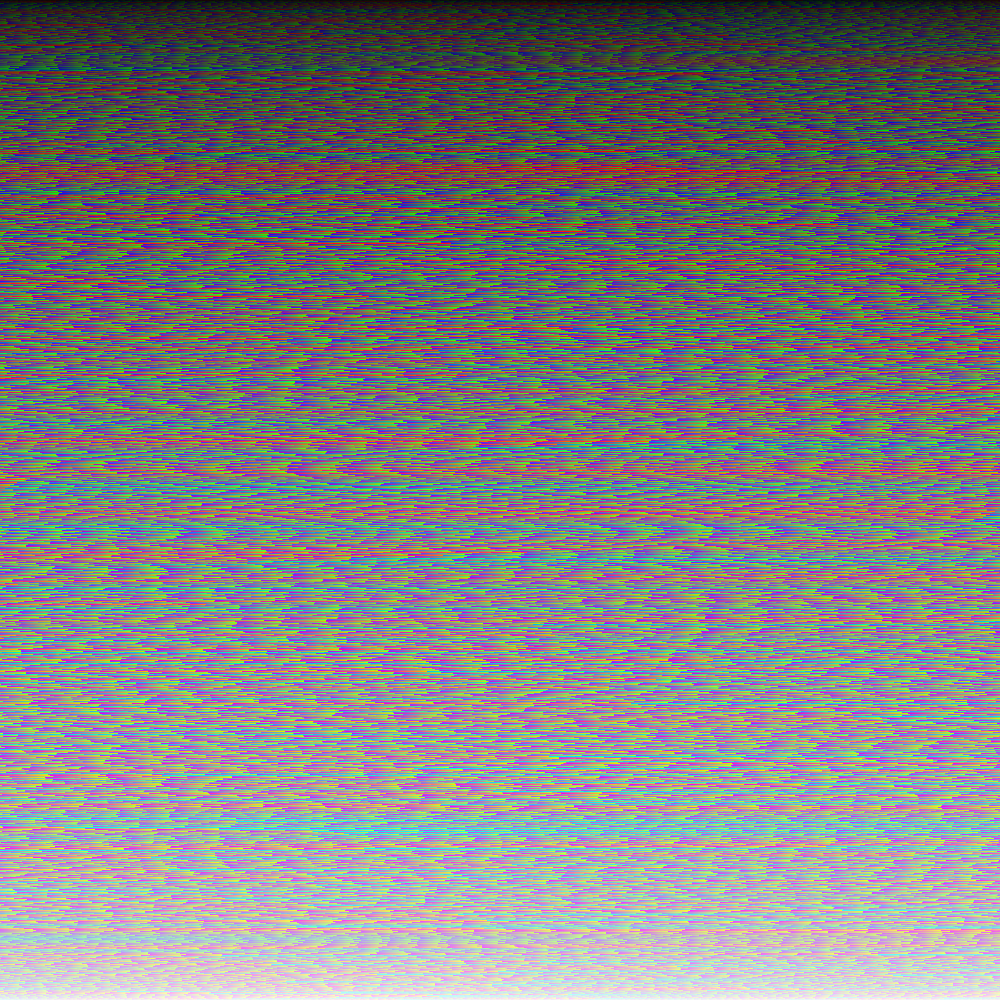
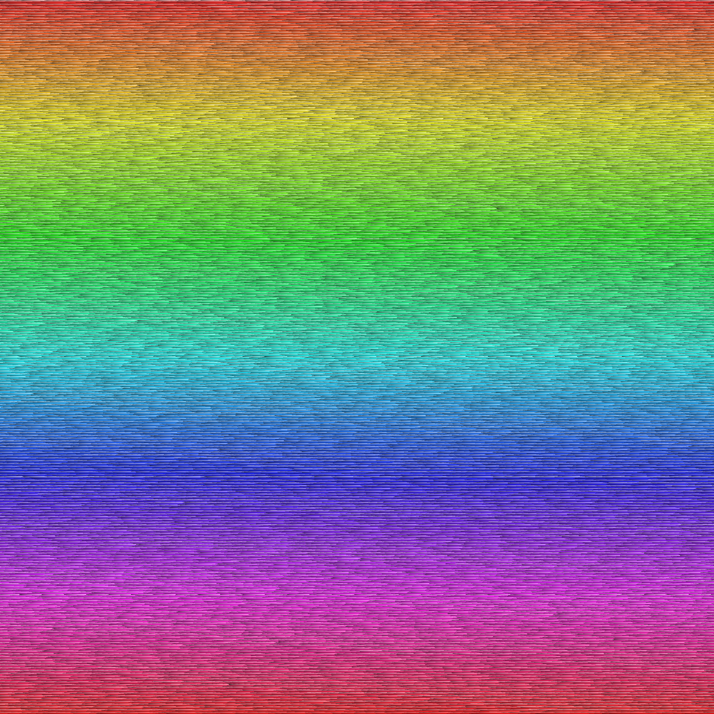
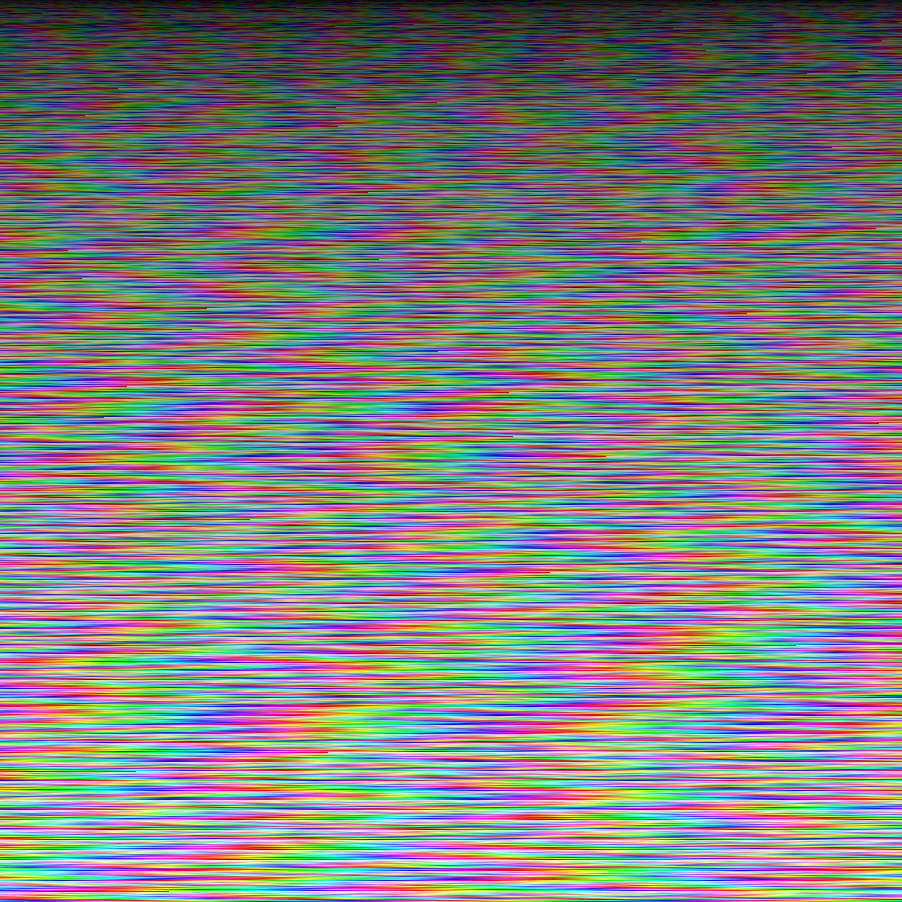

# 24ビットフルカラーの全ての色を並べてみる

1チャンネル8ビットのRGB、すなわち24ビットフルカラーで表現可能な色の数は、$2^{24}=16,777,216$色 (約$1,677$万色)です。$1,677$万色というのは一見するととても多く感じられるかもしれませんが、例えば24MPの画像は$2,400$万画素な訳なので、24ビットフルカラーで画素数が24MPの画像には、必ず同じ色が2回以上現れることになります。このように考えると、$1,677$万色というのは意外にも少なく感じられてきます。

24ビットフルカラーの全ての色を並べてみることを考えてみます。$\sqrt{2^{24}}=2^{12}=4,096$なので、$4,096\times 4,096$の大きさの画像があれば、24ビットフルカラーの全ての色をちょうど並べきることができます。

## 並べてみた

描画には[Processing](https://processing.org/)を使います。

カラーコード順に、左上から並べた場合です。

```java
void setup() {
  size(4096, 4096);
  noStroke();

  int i = 0;
  for (int y = 0; y < 4096; y++) {
    for (int x = 0; x < 4096; x++) {
      fill(i / 256 / 256, i / 256 % 256, i % 256);
      rect(x, y, 1, 1);
      i++;
    }
  }
}
```

一行目に#000000…#000fff、二行目に#001000…#001fffという風に順番に並んでいます。



赤色成分が、$256\times 256$の正方形ごとに1増えるようにします。

```java
void setup() {
  size(4096, 4096);
  noStroke();

  for (int y = 0; y < 4096; y++) {
    for (int x = 0; x < 4096; x++) {
      fill(y / 256 * 16 + x / 256, y % 256, x % 256);
      rect(x, y, 1, 1);
    }
  }
}
```



各成分の合計の順にソートして、左上から並べてみます。

```java
void setup() {
  size(4096, 4096);
  noStroke();
  ArrayList<Integer> colors = new ArrayList<Integer>();

  for (int r = 0; r < 256; r++) {
    for (int g = 0; g < 256; g++) {
      for (int b = 0; b < 256; b++) {
        colors.add(color(r, g, b));
      }
    }
  }

  colors.sort((a, b) -> {
    if (Float.compare(red(a) + blue(a) + green(a), red(b) + blue(b) + green(b)) != 0) {
      return Float.compare(red(a) + blue(a) + green(a), red(b) + blue(b) + green(b));
    }

    return a - b;
  }
  );

  int i = 0;
  for (int y = 0; y < 4096; y++) {
    for (int x = 0; x < 4096; x++) {
      fill(colors.get(i));
      rect(x, y, 1, 1);
      i++;
    }
  }
}
```



Hue, Saturation, Brightnessの順に並べてみます。

```java
void setup() {
  size(4096, 4096);
  noStroke();
  ArrayList<Integer> colors = new ArrayList<Integer>();

  for (int r = 0; r < 256; r++) {
    for (int g = 0; g < 256; g++) {
      for (int b = 0; b < 256; b++) {
        colors.add(color(r, g, b));
      }
    }
  }

  colors.sort((a, b) -> {
    if (Integer.compare((int)hue(a), (int)hue(b)) != 0) {
      return Integer.compare((int)hue(a), (int)hue(b));
    }

    if (Integer.compare((int)saturation(a), (int)saturation(b)) != 0) {
      return Integer.compare((int)saturation(a), (int)saturation(b));
    }

    if (Integer.compare((int)brightness(a), (int)brightness(b)) != 0) {
      return Integer.compare((int)brightness(a), (int)brightness(b));
    }

    return a - b;
  }
  );

  int i = 0;
  for (int y = 0; y < 4096; y++) {
    for (int x = 0; x < 4096; x++) {
      fill(colors.get(i));
      rect(x, y, 1, 1);
      i++;
    }
  }
}
```



Brightness, Saturation, Hueの順にしてみます。

```java
void setup() {
  size(4096, 4096);
  noStroke();
  ArrayList<Integer> colors = new ArrayList<Integer>();

  for (int r = 0; r < 256; r++) {
    for (int g = 0; g < 256; g++) {
      for (int b = 0; b < 256; b++) {
        colors.add(color(r, g, b));
      }
    }
  }

  colors.sort((a, b) -> {
    if (Integer.compare((int)brightness(a), (int)brightness(b)) != 0) {
      return Integer.compare((int)brightness(a), (int)brightness(b));
    }

    if (Integer.compare((int)saturation(a), (int)saturation(b)) != 0) {
      return Integer.compare((int)saturation(a), (int)saturation(b));
    }
    
    if (Integer.compare((int)hue(a), (int)hue(b)) != 0) {
      return Integer.compare((int)hue(a), (int)hue(b));
    }

    return a - b;
  }
  );

  int i = 0;
  for (int y = 0; y < 4096; y++) {
    for (int x = 0; x < 4096; x++) {
      fill(colors.get(i));
      rect(x, y, 1, 1);
      i++;
    }
  }
}

```



## 余談

上記以外にもいろいろ並べ方を試したものの、ランダムに色を入れ替えたりした場合には、PNGファイルが50MBを超えてしまい、[optipng](https://optipng.sourceforge.net/)を用いても圧縮率が悪くファイルサイズを削減できませんでした。

また、最初は[p5.js](https://p5js.org/)を使っていましたが、色のソート処理が遅かったため、Processingで書き直しました。p5.jsやProcessingはこのような画像を描画するのが手軽で便利ですね。