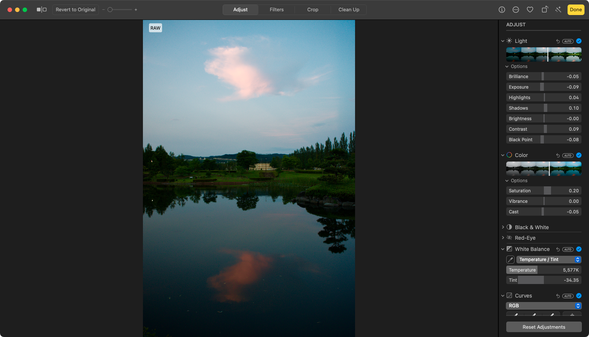

# 写真ギャラリーページを作った

[私が撮った写真を並べるギャラリーページ](/photograph)を作りました。自分でも、今までなぜ作っていなかったのか疑問なくらいです。

このページを作ったきっかけは、macOSに同梱されているPhotos.appでRAW現像できるということに今更気づいたことです。

私は今までRAW現像といえばLightroomを使っていたのですが、月額が高いので最近は契約していませんでした。カメラメーカーがリリースしているRAW現像ソフトウェアも当然あるのですが、お世辞にも使いやすいとはいえません。

そこでPhotos.appです。Lightroomほどの自由度はありませんが、簡単な編集には十分使えますし、Apple製なのでインターフェースが使いやすいです。

以前は[NEX-7](https://www.sony.jp/ichigan/products/NEX-7/)で撮ることが多かったのですが、中古の[RX100II](https://www.sony.jp/cyber-shot/products/DSC-RX100M2/)を手に入れてからはRX100IIをよく使っています。ポケットに入るサイズですし、電池もそれなりに持つので、外に出る時はいつも持ち歩いています。