# 護衛艦「いなづま」を見てきた

6月1日、みなとみらいで開かれていた第44回横浜開港祭に行ってきました。こっちに引っ越してからというものの、護衛艦を見てみたいとは思っていたのですが、なかなか都合がつかず見れずにいました。

護衛艦に興味を持ったきっかけは、やっぱり[艦これ](https://games.dmm.com/detail/kancolle)の存在が大きいです。なんで今更になって艦これ始めたの、という話ではありますが。当時はソシャゲへの興味が薄く手を出していなかったのです。しかし最近になって艦これってまだ続いてるの？ってな感じで始めたところ見事にハマってしまいまして。カジュアルに遊ぶ分にはお金があまりかからないのが私のような金欠学生には嬉しいところです。

護衛艦と帝国海軍の艦艇の間に直接的な関係があるわけではないのですが、艦名は帝国海軍時代のものを踏襲して命名されていることが多いのが面白い点です。帝国海軍の「いなづま」といえば、敵の乗組員を救助したことで知られる吹雪型駆逐艦「電」じゃないでしょうか。

桜木町駅の方から歩いて行ったのですが、視界に入るや否や、その灰色のフォルムに見惚れてしまいました。決して大きい船ではないのですが、普通の船にはない存在感を放っているのです。

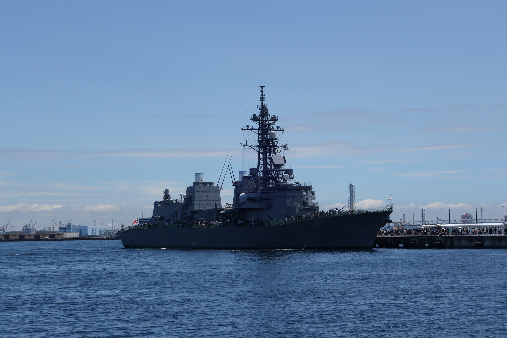

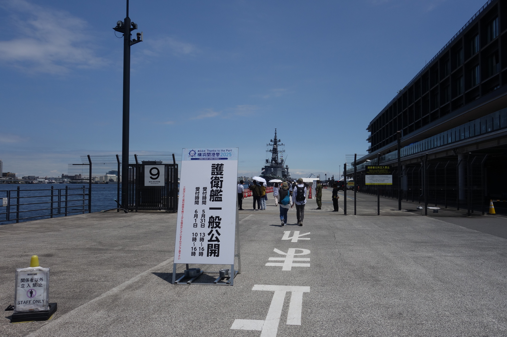

並び始めてから乗船するまでは大体20分くらいだったでしょうか。しかし、間近で見るとその大きさに圧倒されますね。

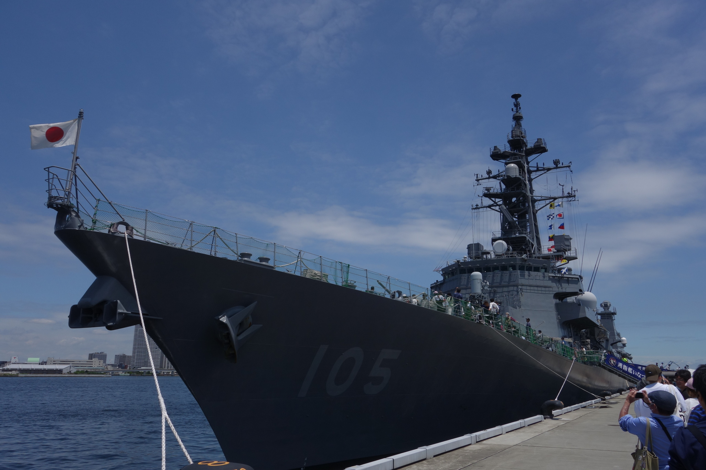

VLSとか主砲とか魚雷発射管とか。前方のVLSは対潜とのこと。

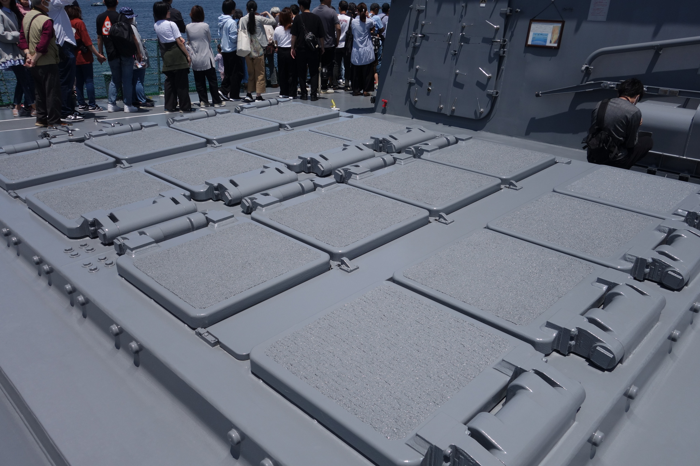

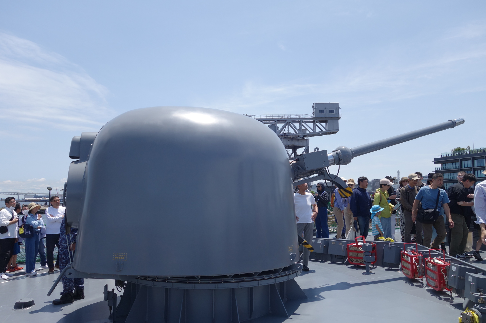

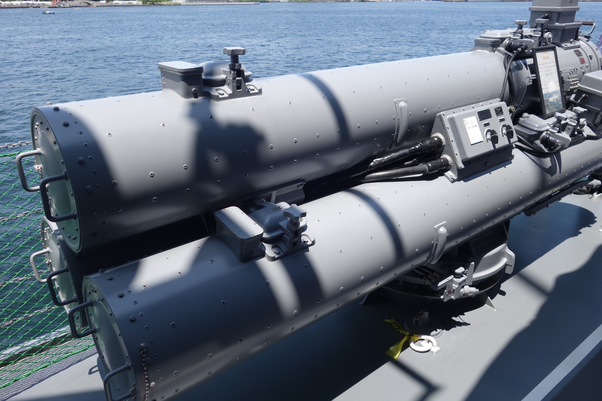

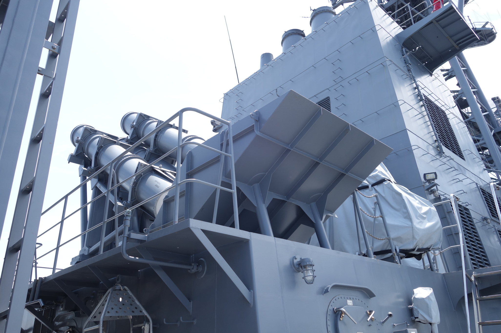

いわゆる駆逐艦のイメージだったので、ヘリコプターを搭載できるのは意外でした。

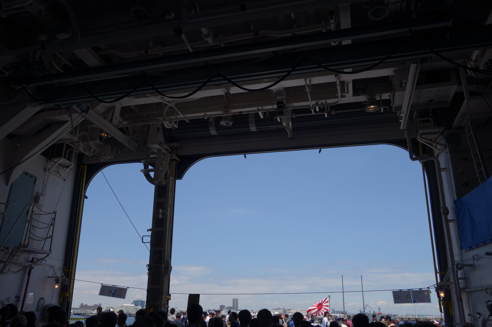

御朱印を頂きました。護衛艦にも御朱印があるのですね。

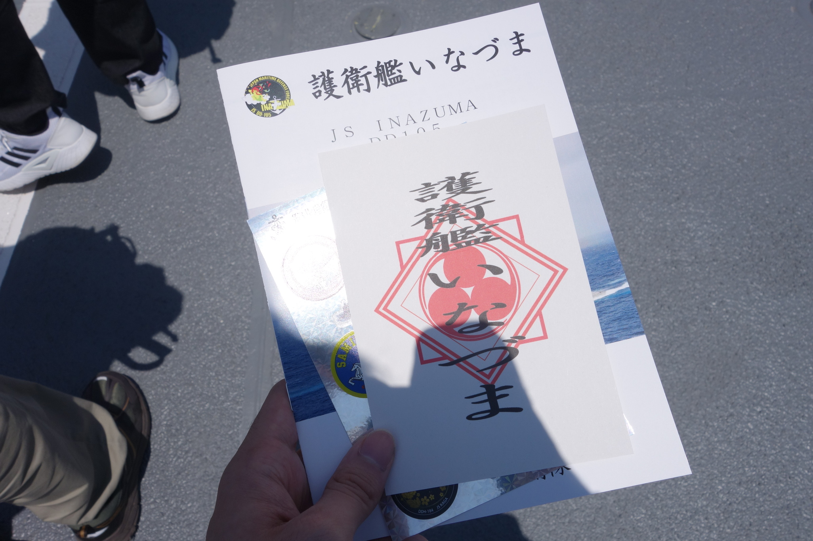

何気にハンマーヘッドに来たのは今回が初めてです。艦これアニメ二期の最終話で最上がハンマーヘッドを見上げているカットがあったような。

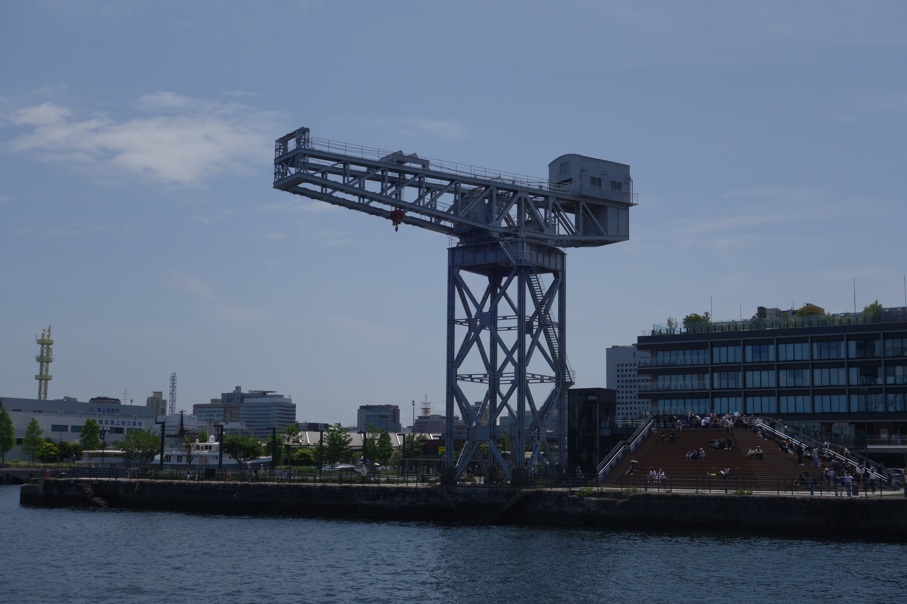

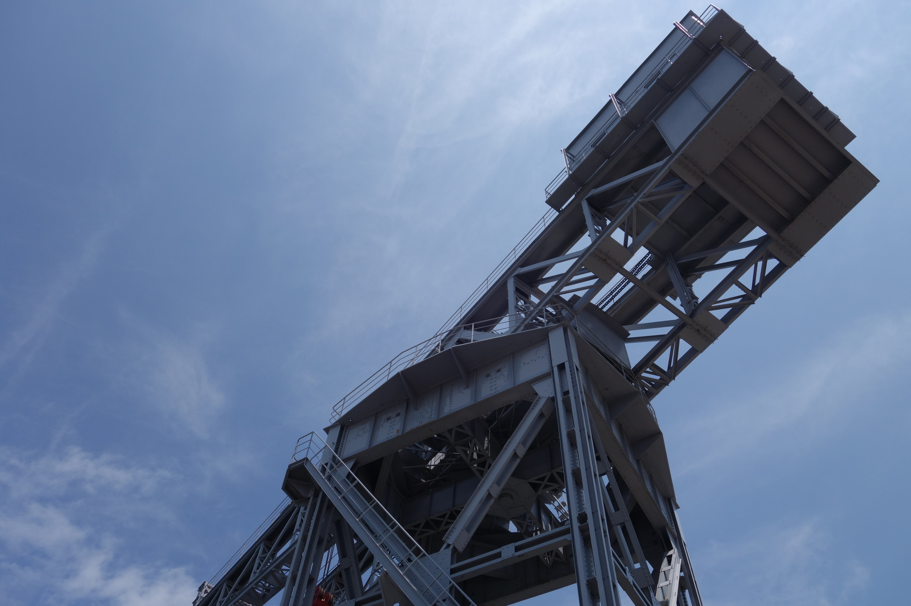

見学を終えて、いなづまとハンマーヘッドを遠方より。

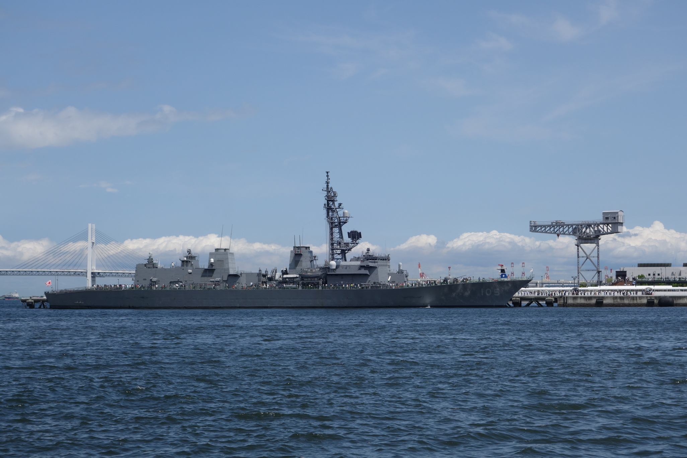

自衛隊の見学イベントに参加したこと自体が初めてだったのですが、なかなかに楽しめました。タダでこんな体験ができるというのは——すなわち、私たちの税金から費用が捻出されているというわけですね。そう考えるなら、こういうイベントには積極的に参加すべきなのではないでしょうか。

護衛艦の活躍というのは、多くの国民が顧みるものではないのかもしれません——艦これを知る前の私のように。しかし、それはそれで幸せなことなのでしょう。そう考えると、陰で日本の平和を見守る護衛艦たちはどこか健気で愛らしく見えてはこないでしょうか。