# お台場に行ってきた

6月21日、天気が良かったのでお台場に行ってきました。特に下調べとか全くせず行ったのですが、結果として艦これアニメの聖地巡礼のような感じに。

## 台場公園

東京テレポートでりんかい線を下車。プロムナードを歩いて砂浜を横目に北に歩いていきますと、台場公園にたどり着きます。

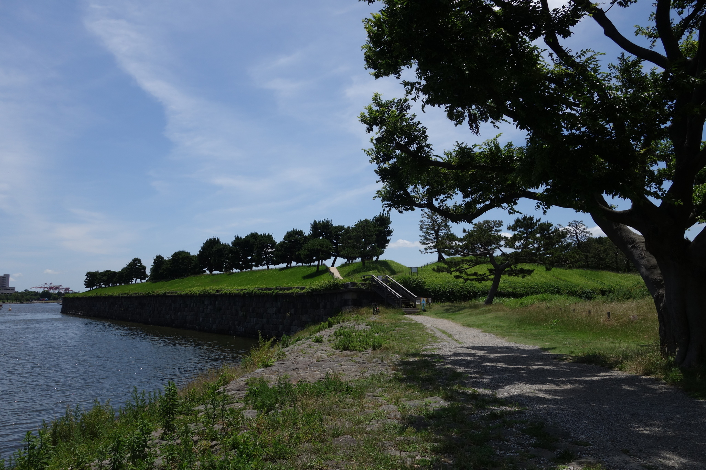

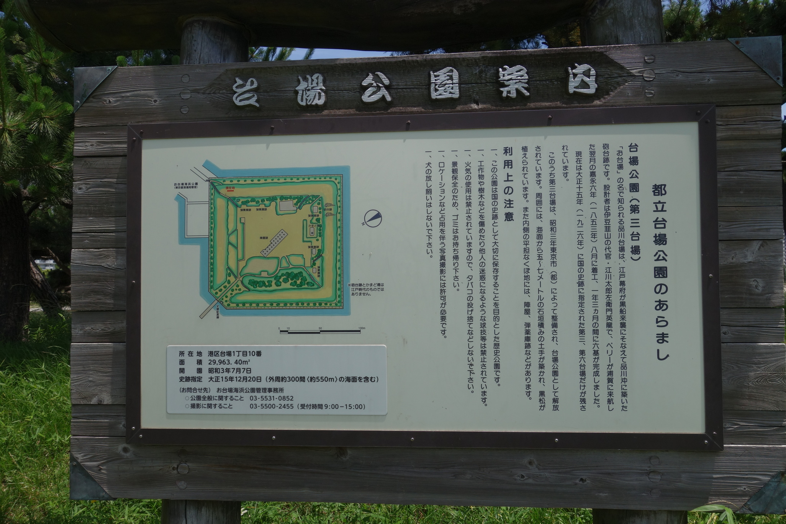

案内板にもありますが、実はこの場所こそがお台場がお台場と呼ばれている所以なのです。江戸時代にペリーらの黒船が来航したのちに作られた砲台の一つが、この台場公園にある第三台場だったというわけです。

では、第一、第二台場はどこなのか？という疑問が浮かびます。第六台場はこの第三台場のすぐ隣に見えるのですが、この二つ以外の台場は現存しないようです。地理院地図で1940年頃の航空写真を見ると、確かに南西の方角に4つ、それらしきものが確認できます。

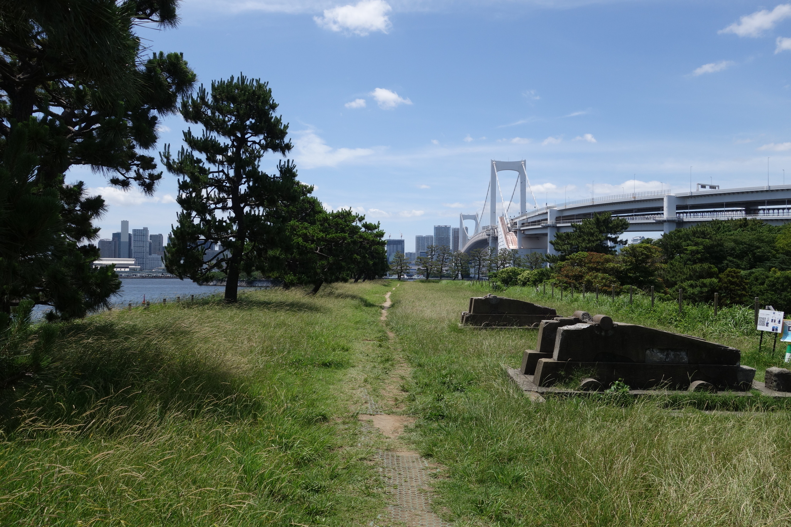

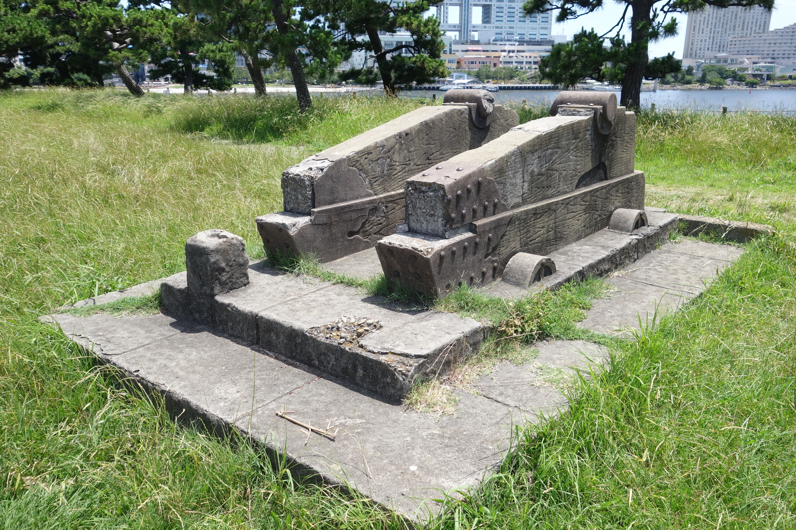

砲台跡ですが、江戸時代のものではないと書かれています。約300年前ですし、修復を施しているということでしょうか。あるいは、完全にレプリカということなのでしょうか。

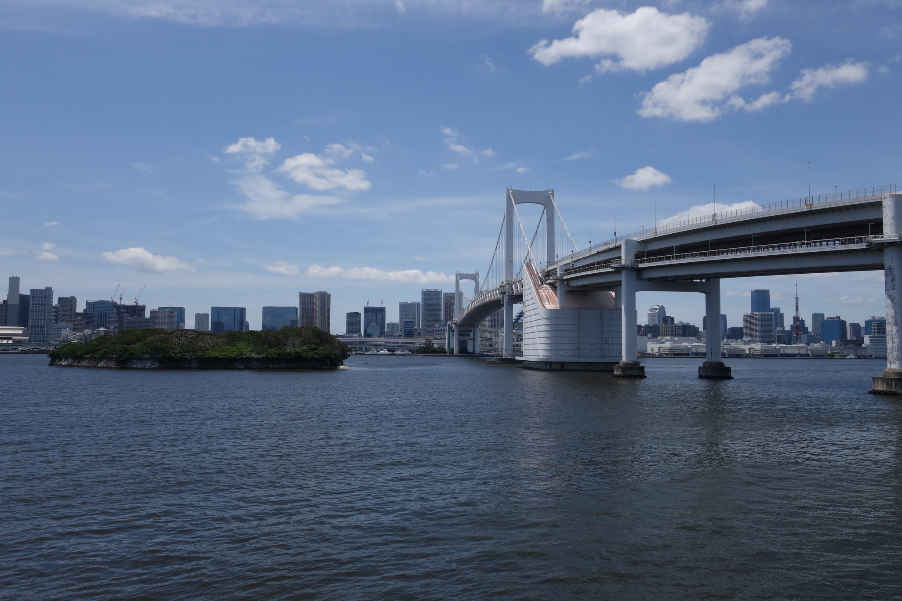

第六台場、レインボーブリッジ、そして遠くに東京タワーです。

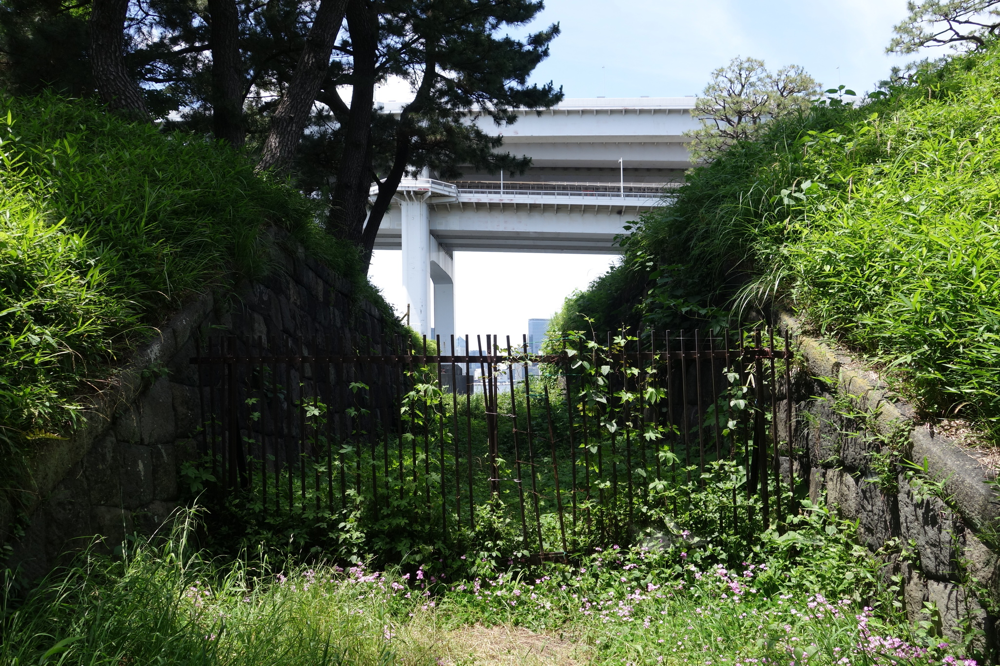

この柵の向こうが波止場です。

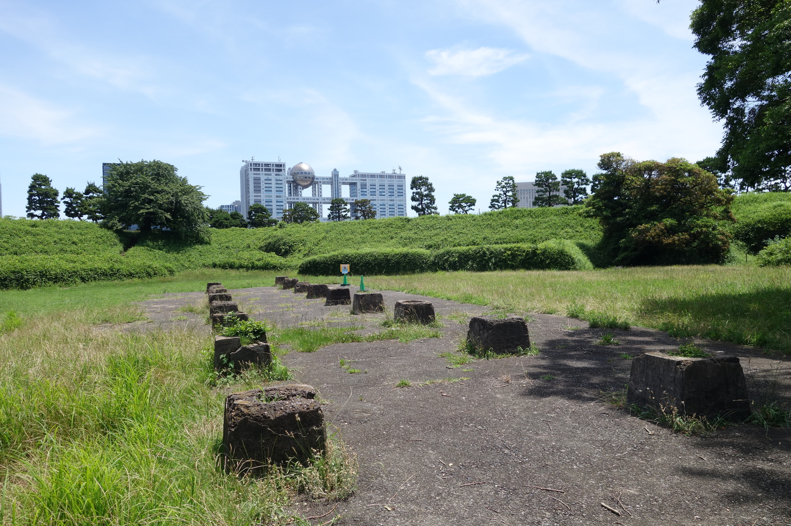

陣屋跡とのことですが、これでは当時の姿は全く見当もつきませんね。そしてフジテレビの社屋の存在感。

かまど場と弾薬庫跡もあるようですが、今回の訪問では見逃してしまいました。これらはまたの機会にということで。

## 自由の女神像

台場公園を後にし、海岸沿いを戻り、海沿いのプロムナードを歩いていたところ、突如として現れたのがこの自由の女神像です。

お台場になぜ自由の女神が？ニューヨークにある自由の女神と何の関係があるのか？その答えは、ここに書かれていました。

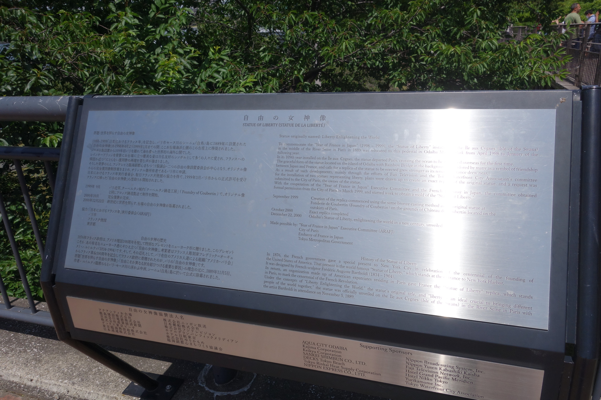

フランスがアメリカに贈った自由の女神は有名すぎますが、そのお返しとして作られた自由の女神があったとは知りませんでした。そして、その第二の自由の女神像がお台場に設置されていたことがあったとは。面白い発見もあるものです。

この像の後ろを振り返りますと、フジテレビの社屋が聳え立っています。

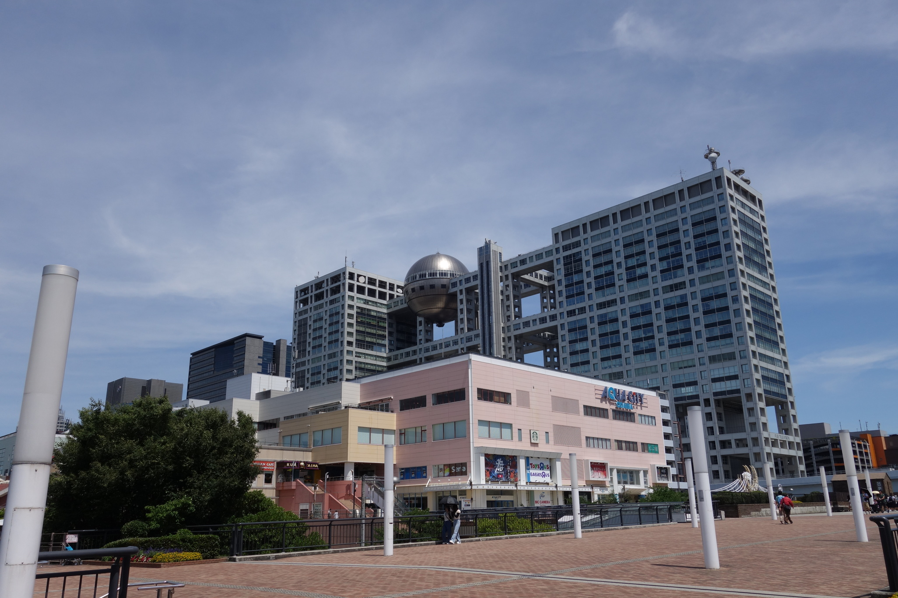

お台場に来るのは初めてなので、この建物を見るのも勿論初めてです——テレビの向こう側でなら、何度も見たことがあるのですが。しかしこの建物を見ると、どこか夢の跡のようで、寂しい気持ちになるのは私だけでしょうか。かつてお茶の間を彩ってくれたテレビ番組の思い出と、テレビジョンの衰退と。様々な思いが込み上げてきます。

## 南極観測船「宗谷」

昼食を済ませて、最後に向かったのが、南極観測船「宗谷」です。

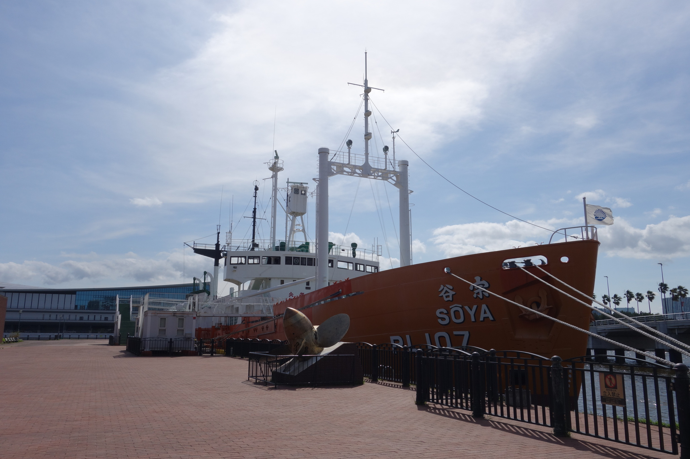

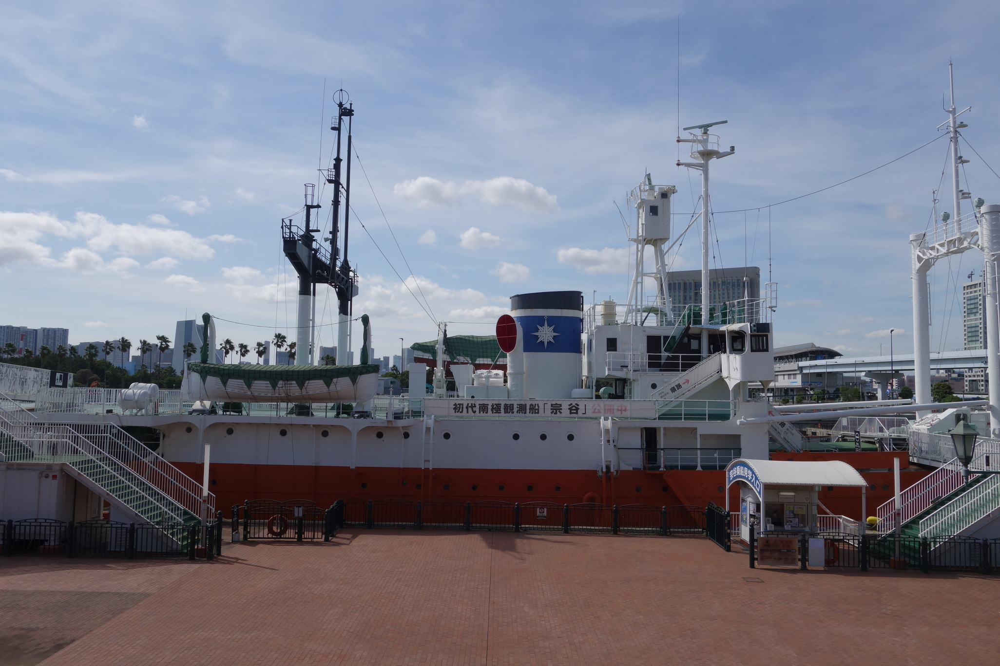

写真は個人的使用のみ可能ということが書かれているので、外観だけにとどめておこうと思いますが、何より入場が無料というのが素晴らしいです。寄付金で維持費を賄っているとのことで、微力ながら協力させていただきました。

宗谷は当初、商船として建造されましたが、太平洋戦争には特務艦として、主に海図の測量を行ったことで知られています。特務艦時代の、魚雷を一本受けたものの、不発で難を逃れたエピソードから、幸運艦と呼ばれることもあるようです。

展示物に関しては、基本的には南極観測船以降の活躍が主でした。南極観測船ということもあり、ペンギンの置物や写真が随所に見られるのが特徴的でした。宗谷だけでなく、現役の「しらせ」など他の砕氷船に関する情報もありました。

また企画展示として、南極観測隊に同行し、南極に取り残された樺太犬に関する展示がありました。南極基地に取り残されて、1年後に奇跡的に救出されたタロとジロの模型などです。これは私も初めて知ったことなのですが、1950年代の初期の南極観測においては、雪上車ではなく樺太犬による犬ぞりがよく使われていたというのです。現在の動物倫理から考えると、残酷なようにも思えてくるところはありますが。

もちろん、これ以外にも居室や操舵室など見所は尽きないのですが、今回はこの辺に留めておきましょう。

実はこの宗谷、元々は船の科学館の展示の一つで、他にも本館などがあったみたいなのですが、2011年に休止してしまったようです。本館は解体工事が行われており、行った時にはほぼ更地になっていました。リニューアル計画自体は続いているようなので、今後に期待です。

以上で今回のお台場訪問記は終わり。お台場というとダイバーシティのイメージが強いです（実際めちゃくちゃ混んでいた）が、こんな感じで史跡や展示を巡るのも楽しいのでおすすめです。