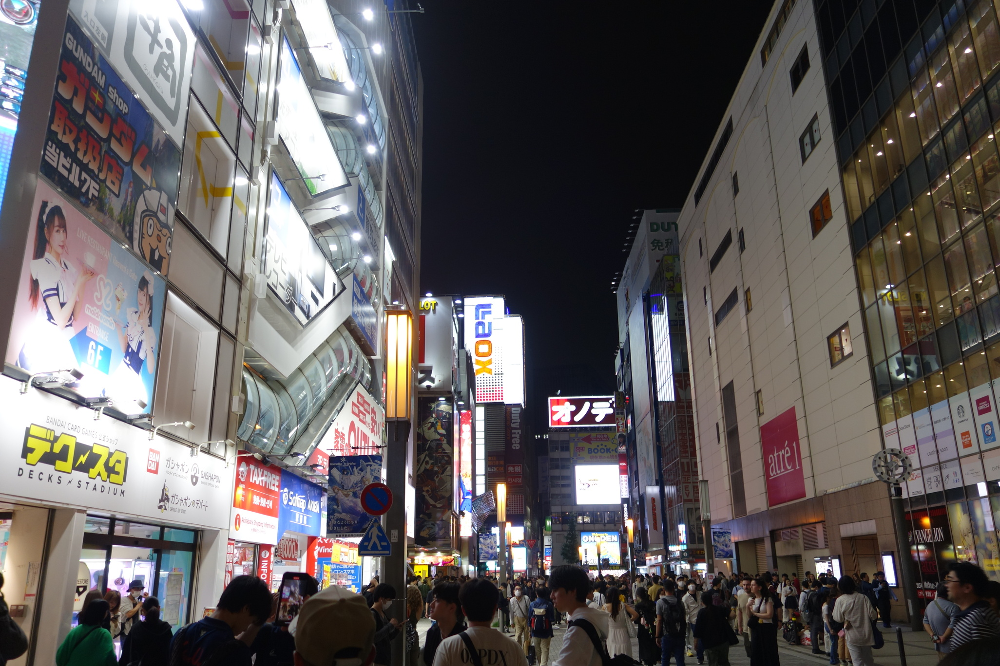
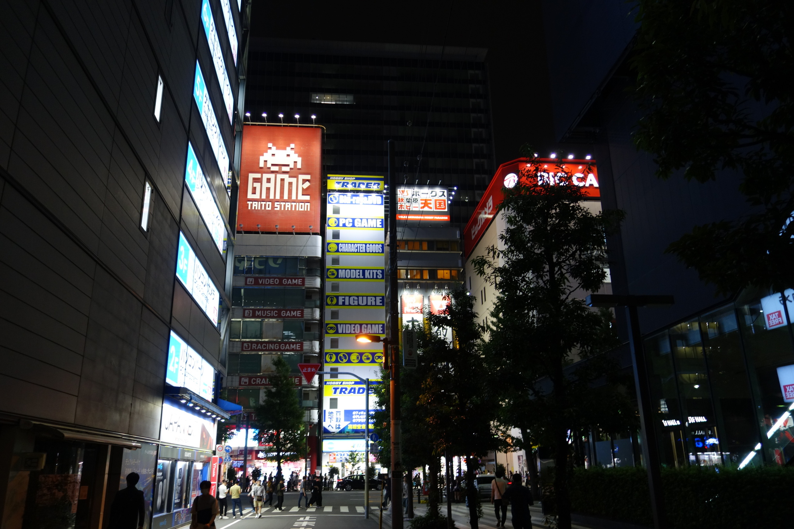
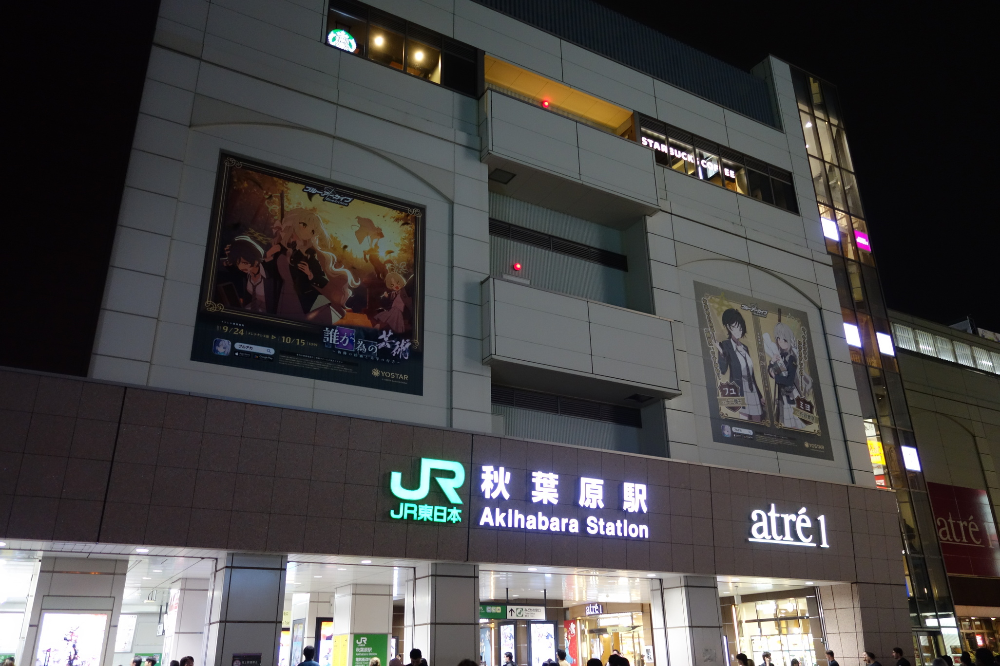
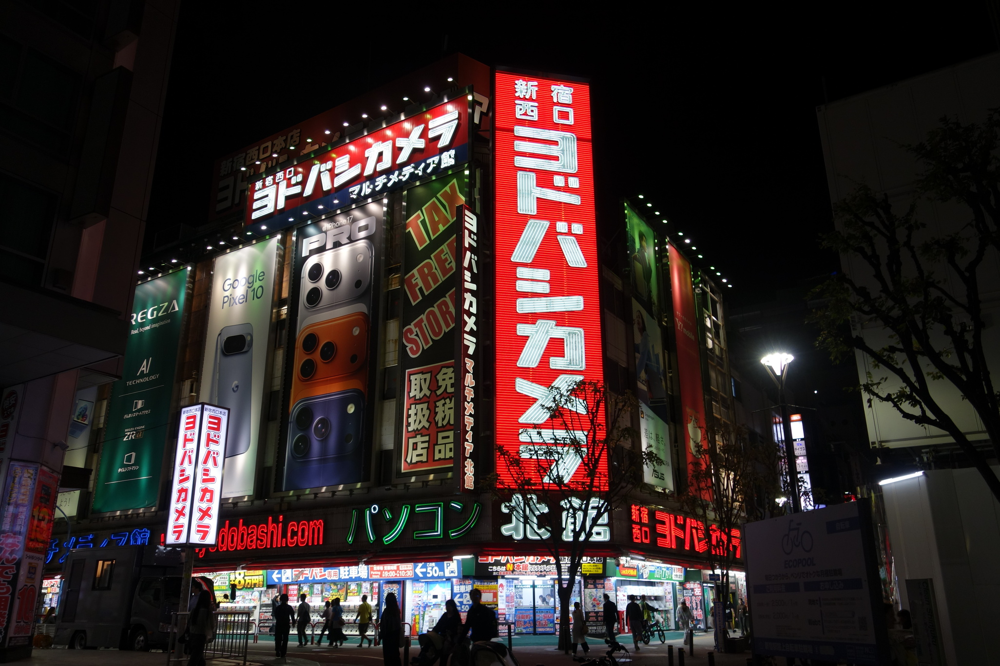
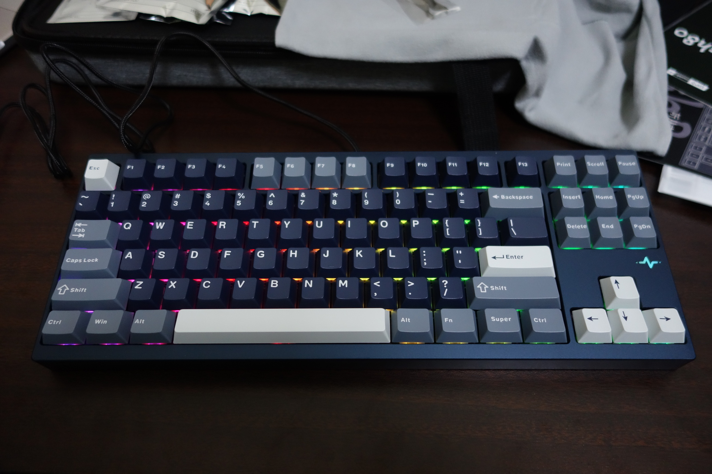

# 最高の打ち心地を探す旅の最果てに、3万6千円のキーボードと運命を共にすることにした

インターンの給料を手にしてからというものの、私は買うべきものを探していた。とはいっても金額としては、新型iPhoneが買えるか買えないかくらいであり、大きな買い物をするというよりは、周辺機器やPCパーツの購入に当てようかと考えていた。

そこで私は、新しいキーボードを買うことにした。

なぜ新しいキーボードが必要なのか。それは、今まで使ってきたキーボードに不満が募っていたためである。今まで使っていたのは、中華茶軸の65%キーボードだったのだが、私にとって、65%キーボードはファンクションキーが無いというのが不便で仕方がなかった。もちろん、Fnキーと数字キーの同時押しでファンクションキーを入力すること自体は可能だ。

しかし、これには落とし穴がある。macOSでは、ファンクションキーが2つの役割を持つのだ。これはどういうことかというと、例えば、MacBook ProのF12キーを押すと音量が調整できる——OSがファンクションキーを乗っ取っている——が、Fnキーと同時にF12キーを押すと、アクティブなアプリケーションに対してF12キーが送信される、という挙動になっているのである。

私が使っていたこの65%キーボードでは、このOS側のファンクションキーにアクセスするために、更にストロークが必要になるという点がフラストレーションを生んでいた。あまりにもストロークが多いので、これらの操作はマウスでやってしまったほうが楽というレベルであった。

とにかく、ファンクションキーがないことによる作業効率の低下はもう避けたい。そして、あわよくば最高の打ち心地のキーボードを手に入れたい。ということで私は、最高のキーボードを探すべく、夕刻の秋葉原へと向かった——。

## 秋葉原編

秋葉原に着くまでの私は、あの名高いRealforceを買えば良いだけなんじゃないかと思っていた。自分の中でRealforceという高級ブランドへの憧れがあったのかもしれない。というのも、エンジニア界隈ではRealforceやHHKBの話をよく聞くので、Realforceを買えば良いのだとばかり思っていた。しかし、ヨドバシAkibaのキーボードコーナーを訪れた時、この考えは大きく揺らいだ。

Realforceの感触は、他のモデルではあるが研究室で使っているのでそれほど驚きはなかったのだが——その右隣に置かれていたKeychron、そして、Wobkeyのキーボードが気になった。特に、Kailh Cocoa軸を搭載したWobkey Crush80 Reboot Proのコトコトとした音と感触には衝撃を受けた。こんな小気味良いキーボードには今まで触れたことがなかった。

せっかく秋葉原に来ているので、この場で即決することはせず、一度ヨドバシAkibaを後にし、中央通り沿いのパソコンショップを何軒か巡ることにした。外はすっかり暗くなっていた。

パソコンショップを3軒ほど巡った結果、私の考えは大きく掻き乱された。私が知らなかった、魅力的なキースイッチを搭載したキーボードが沢山展示されていたからである。具体的には

- Akko AstroAim Magnetic
- Akko Astrolink Magnetic
- OKT Cyan
- OKT Amethyst

あたりのキースイッチはどれも感触が私の好みで、甲乙をつけることができなかった。ひょっとすると、自作キーボードの門を叩くべきなのではないかとすら思った。でも、自作までするのはやりすぎの感が否めない。キーボードにそれほどの執着をするほどの時間もお金もないのである。

結局この日は、どのキーボードを買うのかを決めることができなかった。

## 新宿編

次の日。昨日、キーボードを買わずに帰ってきたことが、一日中気がかりで仕方がなかった。結局、日が暮れてから新宿西口のヨドバシに向かうことにした。

なぜ新宿西口のヨドバシか。それは、Realforce R3SB31の在庫があるのがここくらいしかなかったからである。そう、昨日あれだけ迷い続けた結論として、やはりRealforceを買ってしまえば良かったのだと信じて、再びヨドバシのキーボードコーナーに足を運んだのである。

ヨドバシ新宿西口の周辺機器コーナーは地下1階。階段を下り、キーボードコーナーを見つけ早速Realforce R3SB31があることを確認。Realforceに心を決めていたが、念の為、他のキーボードも見てみることにした。

ラインナップはAkibaとあまり変わらなかった。しかし、KeychronのGateron Jupiter Banana軸搭載機は、Akibaには展示されていなかった気がする。このBanana軸もまた、タクタイルな感触と底打ち音が心地よく、いつまでも触っていたいと思った。

再びWobkeyのCocoa軸にも触れてみた。Banana軸と比較するとこちらはリニア寄りで、底打ち音に関しては一番好みであると思った。

Realforceを買うと決心して来たにも関わらず、再びこのもう二つの選択肢に揺れ動かされてしまったのであった。

打ち心地に関しては、Wobkey Cocoa軸やKeychron Banana軸の方が圧倒的であると言わざるを得なかった。Realforceのサクサクとした打ち心地は特段悪いというわけではない。しかしこれらの選択肢と比べたときには、どうしても好みであるとは思えなかったのである。

打ち心地以外の部分も精査してみることにした。特に、外枠に関して言えば、Wobkeyはアルミ削りだしであるのに対し、Realforceの外枠はプラスチック製であった。高級感という意味で言えば、Wobkeyが圧勝していた。

キー配列に関して言うと、Keychronは英語配列がこの店舗では売られておらず、ここで今で買うとしたらKeychronは選択肢から外す他なかった。

キーキャップの形状については、Keychronは丸っこい形であり、これはあまり私の好みであるとは言えなかった。RealforceとWobkeyは、一般的な四角形の形状で手に馴染む。

テンキーの存在の有無。Realforceはテンキーのあり・なしのどちらのモデルも用意されている。一方で、WobkeyはTKLのモデルしかない。テンキーは私にとっては必ずしも必要というわけではなかったが、以前にBlenderを触れたときにテンキーを要求されたため、ないよりはあった方が良いだろうと思った。

このようなこと考えながら、売り場で1時間半近く悩み続けていた。

## 結論

最終的に私は、Wobkey Crush80 Reboot Pro、色はNavyを選択した。税込36,080円であり、検討した選択肢の中では一番高額だった。Realforce R3SB31が22,440円であったから、1.5倍以上の価格である……この値段のキーボードを買うことは後にも先にもこれっきりなのではないか、と思う。

このキーボードを買ったのは良いものの、家に持って帰ってくるまでが大変であった。というのも、このキーボード、公称で重さが約2.4kgとなっているのだ。到底持ち運べるような重さではない。

使い始めてから一日しか経っていないが、感想は今のところ「最高」の二文字に尽きる。キーボードを変えるだけで、こんなにもタイピングの精度と速度が向上するとは思っていなかった。敢えて弱点を挙げるとするならば、打鍵音が心地良すぎて、キーを打つ手を止められないのが玉に瑕であるのかもしれない。