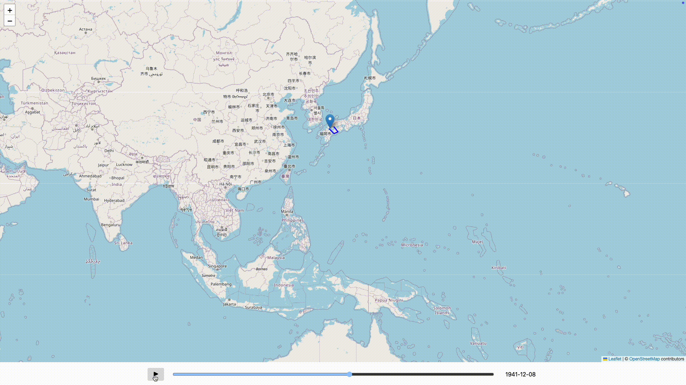

# 戦艦大和の戦歴を、インタラクティブに、データドリブンに、可視化してみた

私は太平洋戦争時代の艦艇の戦歴を読んだりするのが好きな人間ではあるのですが、色々な鑑の戦歴を読んだとしても、艦艇の詳細な移動の記録などは記憶に残りにくいと言いますか、印象的な部分だけしか覚えていられないのですよね。そもそもこの時代だけに限って見ても、船の数は軽く1000は越えていますし、いつどこにどの艦艇がいたか、という状況を文章だけから把握するのはかなり難しいです。

そこで、鑑の行動の軌跡を地図上に、インタラクティブに可視化してみることにしました。一日かけてできたのが、こちら。



戦艦大和の1941年12月8日以降の行動の軌跡です。突貫で作ったので見た目は多分に改善の余地がありますが、大和がいつ、どこにいたのかは一目でわかるかと思います。

行動記録は今のところ、次のようなYAMLで記述しています。

```yaml
places:
  kure:
    name: 呉
    coordinate: [34.23700376520175, 132.55218599664465]
  tosa_bay:
    name: 土佐湾
    coordinate: [33.20932872243247, 133.4812128407135]
  sukumo_bay:
    name: 宿毛湾
    coordinate: [32.84839168881192, 132.5829582727542]
```

```yaml
ships:
  ijn_yamato:
    name: 大和
    affiliation: ijn
    type: battleship
    events:
      - name: 起工
        date: 1937-11-04
        place: kure
        references:
          - "https://ja.wikipedia.org/w/index.php?title=%E5%A4%A7%E5%92%8C_(%E6%88%A6%E8%89%A6)&oldid=106699849"
      - name: 進水
        date: 1940-08-08
        place: kure
        references:
          - "https://ja.wikipedia.org/w/index.php?title=%E5%A4%A7%E5%92%8C_(%E6%88%A6%E8%89%A6)&oldid=106699849"
```

情報の出典は[Wikipedia](https://ja.wikipedia.org/wiki/%E5%A4%A7%E5%92%8C_(%E6%88%A6%E8%89%A6))、[combinedfleet.com](http://www.combinedfleet.com/yamato.htm)、[戦史叢書](https://www.nids.mod.go.jp/military_history_search/SoshoView?kanno=056)などです。無料でこれだけの情報が手に入るのは、最高ですね。本当にありがたい。

他の艦艇の情報も入れる予定ですが、情報を精査して落とし込むのに時間が結構かかるので、主要な艦艇を網羅するとしたら月単位でかかるだろうなぁ、という印象です。

---

- リポジトリ: [https://github.com/k0michi/kantai-explorer](https://github.com/k0michi/kantai-explorer)
- 可視化ページ: [https://k0michi.github.io/kantai-explorer/](https://k0michi.github.io/kantai-explorer/)