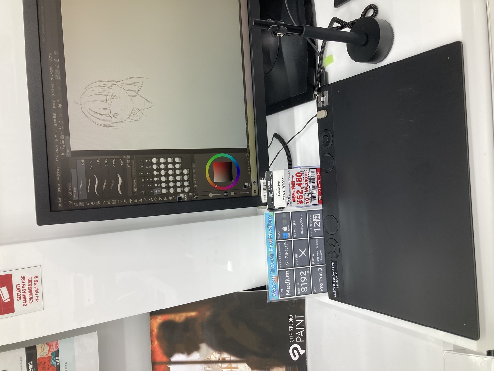
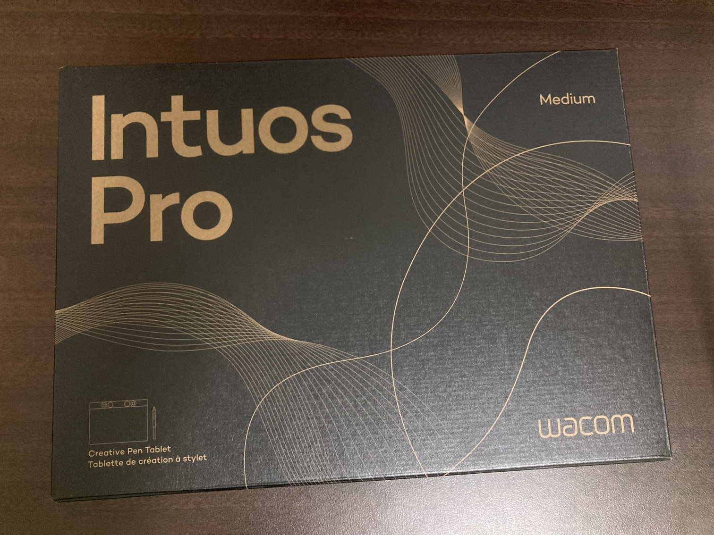
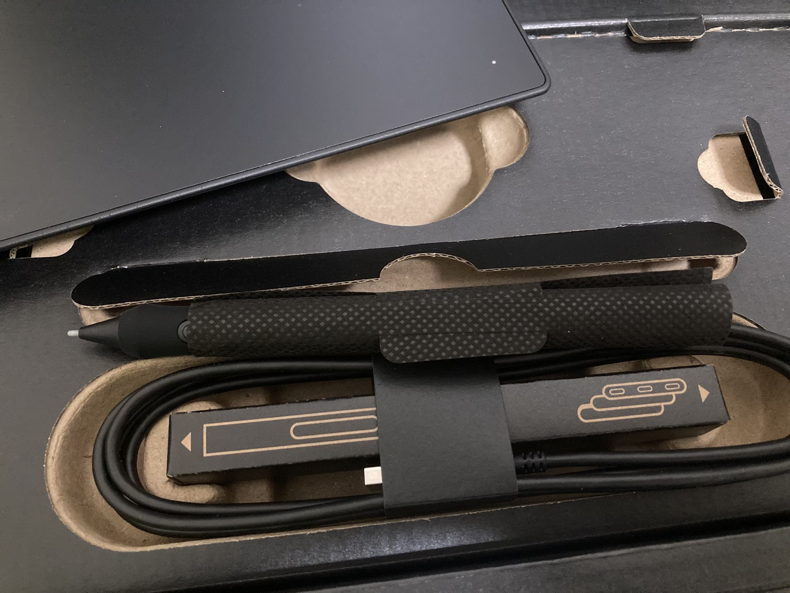
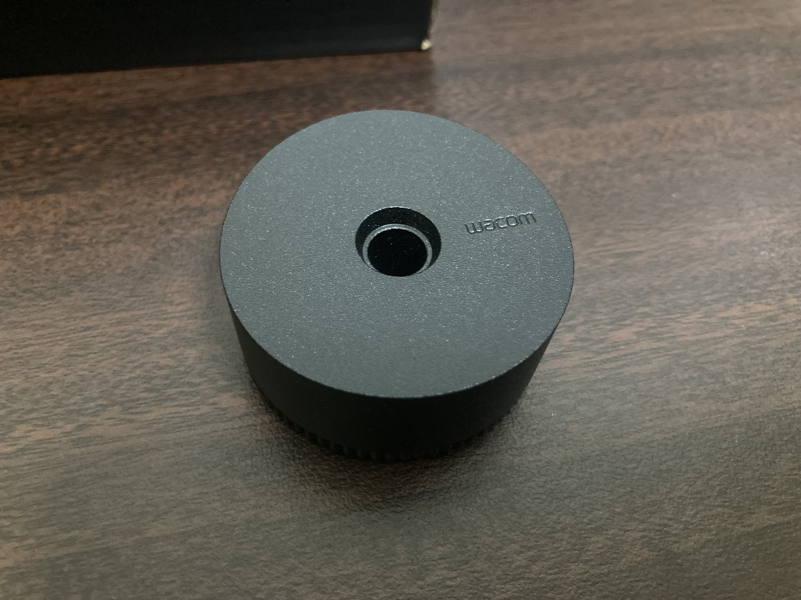
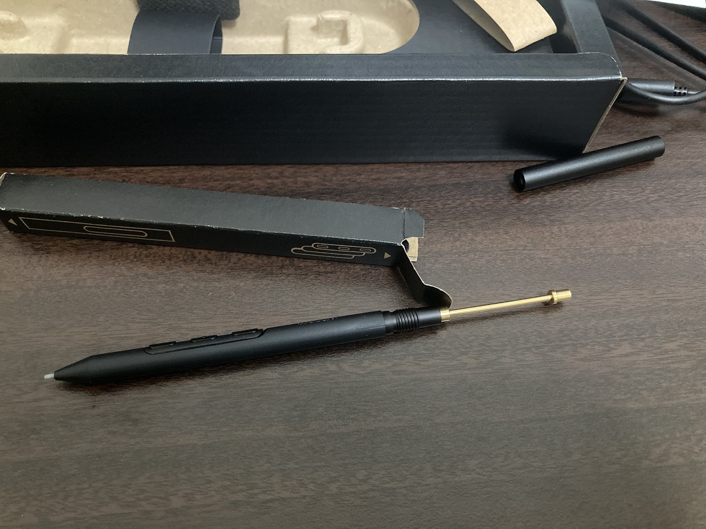
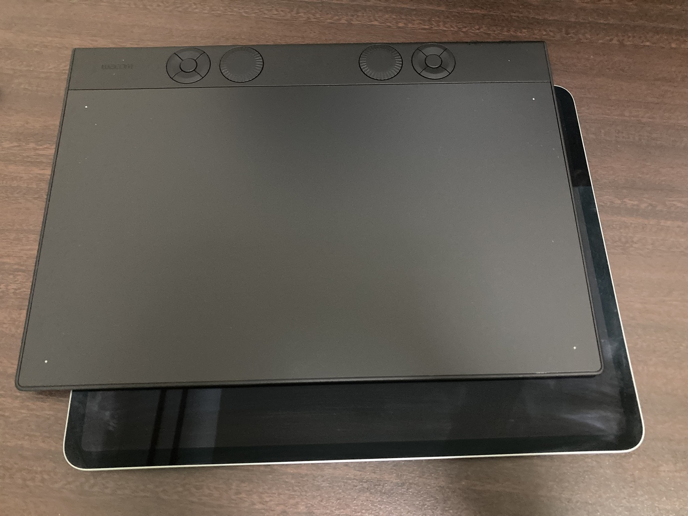
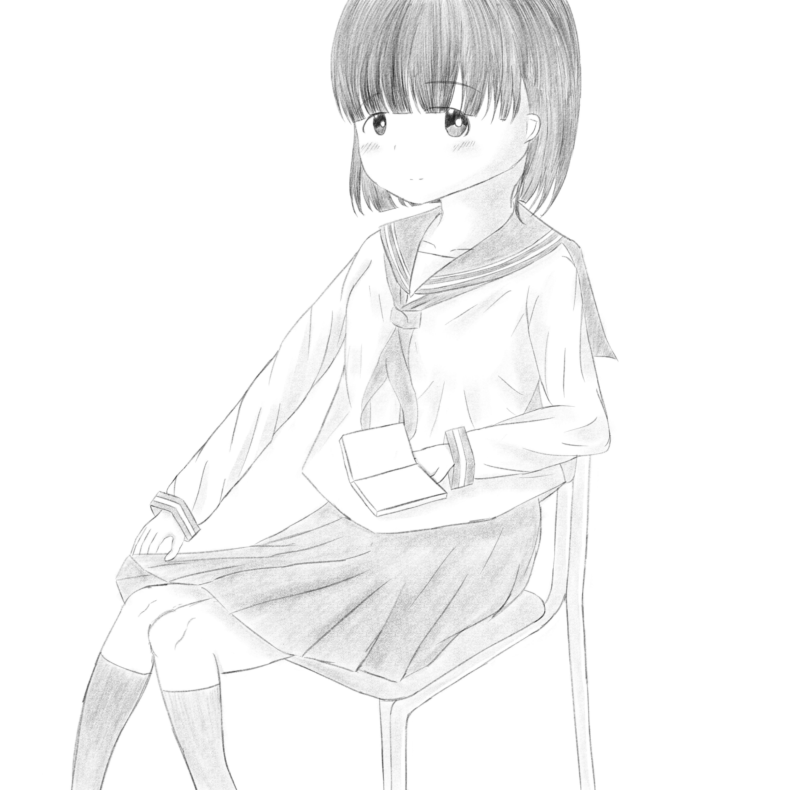

# Intuos Pro Mediumを購入

学会発表を終えて、この春休みは[分散マイクロブログシステムを自作したり](https://github.com/k0michi/ephemera)、そこで[落書きを上げたり](https://koyomi.co/byrcf9j7j_wvx4nyjv22d0591drrpoazayzhq9s7_8r6chkjv)して過ごしていたのですが、いろいろ悩んだ末、Intuos Pro Medium (PTK670)を購入しました。

<figure>
  
  <figcaption>
ヨドバシカメラ新宿西口本店にて
</figcaption>
</figure>

今まで板タブは旧世代のIntuos ([CTH-490](https://101.wacom.com/UserHelp/ja/TOC/CTH-490.html))を使っていたのですが、ペン先を離したタイミングが、座標とズレる、という現象に悩まされてました。あと単純に描ける面積が小さいので、どうしても手首を軸にして描かざるを得ず、線が引きにくいという問題もありました。

なので、新しい板タブの購入を検討していました。候補としてはWacom以外のメーカーのものも考えましたが、ドライバの競合とかが不安だったのでメジャーなWacomの上位グレードが良いということでのIntuos Proです。しかしこのIntuos Pro、お値段がそれなりにします（まあ液タブに比べたら全然安いですが）。

それに、今使ってるIntuosで十分じゃね？という考えが常に脳裏をよぎっていました。あくまで趣味で描いてるだけですし、ハイエンドな機材買っても手に余るだけなのでは？という考えです。

しかし、店頭で触ると値段相応の描き心地の良さがありますし、ペンもIntuosのものよりも持ちやすくて好みで、かなり良さそうだったんですよね。

などなどいろいろ考えましたが、結局はその場の勢いで購入。

付属品はペン、ペン立て、ケーブル、ペンの付け替え部品など。

ペンは標準ではグリップが装着されているのですが、グリップを外すと鉛筆やApple Pencilに近い握り心地にすることができます。製図用シャーペンとかが好きなので、このペンの形状はかなり好きです。

iPad Pro 12.9インチとのサイズ比較。描画エリアのサイズ感としては、ランドスケープモードのiPad Pro 12.9インチと横幅がほぼ同じです。

さてIntuos Proを数日間実際に触ってみた感想ですが、最も驚いたのが、**ペンの傾き検知に対応している点**です。つまり、エントリーモデルであるIntuosではこの機能がオミットされていた、ということなのです。私はこのことを知らず、「板タブでは傾き検知がないのが普通で、Apple Pencilが良すぎるだけ」なのだと勝手に思っていたので、この事実を知って結構驚きました。特にクリスタの鉛筆ツールでは、傾き検知のおかげで表現力が格段に上がります。

ペンも、Intuosより安定していて描きやすい。Intuosと比較すると、適度な重さがあるので筆圧を調整しやすい印象。ポインティングの精度も良く、狙った線を引きやすいように感じます。

<figure>
  
  <figcaption>
作例
</figcaption>
</figure>

総評として、Intuos Proは良い買い物だったと思います。できる表現が増えますし、描きやすいので、絵を描くモチベーションに繋がります。いやむしろ、絵を描くモチベーションを買ったと言ったほうが良いのかもしれませんが。いずれにせよ買って良かったです。