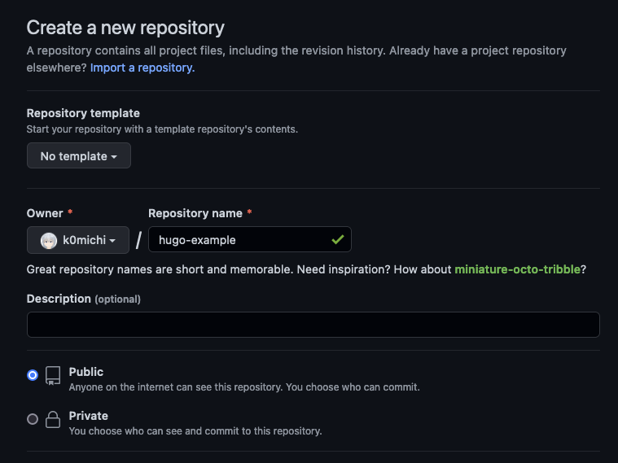
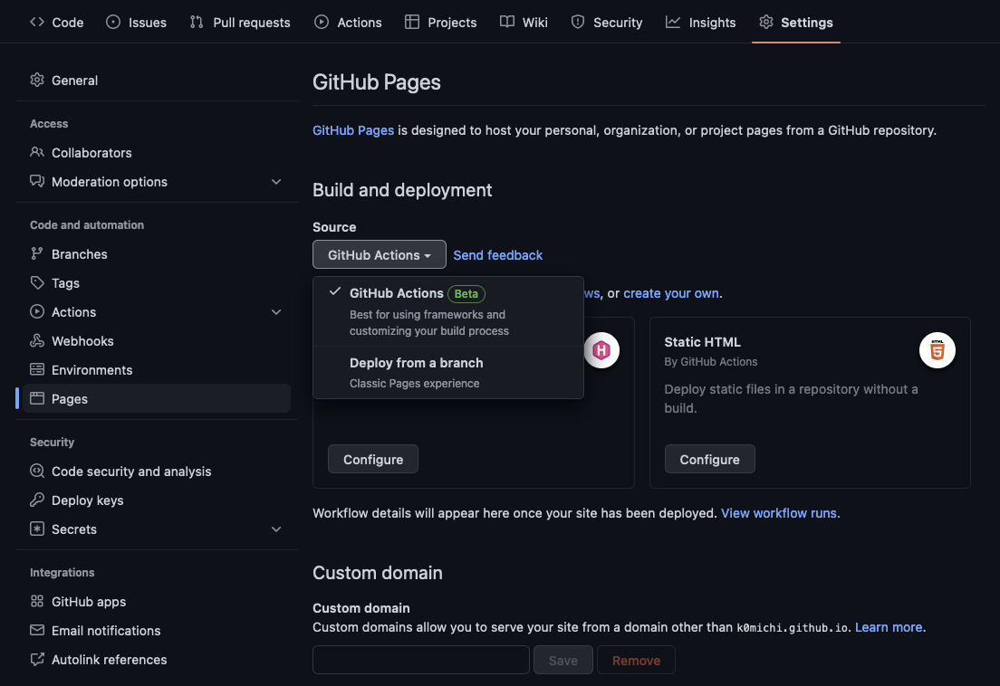
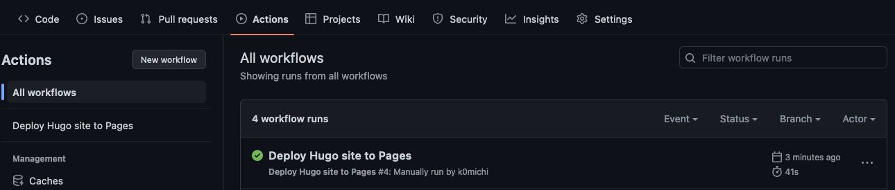

# HugoとGitHub Pagesを使って手軽にサイトを作る方法

静的サイトジェネレーターとGitHub Pagesを使えば、ものの数分で自分のサイトを作って公開することができます。ということで今回は、Hugoで作ったサイトをGitHub Pagesに公開するまでの手順を説明していきます。

## 前提
- GitHubアカウントを持っていること
- Gitがインストールされていること ([インストール方法](https://git-scm.com/book/ja/v2/%E4%BD%BF%E3%81%84%E5%A7%8B%E3%82%81%E3%82%8B-Git%E3%81%AE%E3%82%A4%E3%83%B3%E3%82%B9%E3%83%88%E3%83%BC%E3%83%AB))
- Hugoがインストールされていること ([インストール方法](https://gohugo.io/getting-started/installing/))

## 手順1. Hugoのサイトを作成する
`hugo new site [ディレクトリ名]`で新しくHugoのサイトを作成します。ここでは`hugo-example`というディレクトリ名にしました。
```bash
% hugo new site hugo-example
Congratulations! Your new Hugo site is created in /Users/k0michi/Repository/Development/hugo-example.

Just a few more steps and you're ready to go:

1. Download a theme into the same-named folder.
   Choose a theme from https://themes.gohugo.io/ or
   create your own with the "hugo new theme <THEMENAME>" command.
2. Perhaps you want to add some content. You can add single files
   with "hugo new <SECTIONNAME>/<FILENAME>.<FORMAT>".
3. Start the built-in live server via "hugo server".

Visit https://gohugo.io/ for quickstart guide and full documentation.
```
上記のようなメッセージが出れば、サイトの作成に成功しています。

## 手順2. テーマをインストールする
手順1で作成されたディレクトリに移動してテーマをインストールします。ここでは公式のQuick Startでも使われているAnankeというテーマをインストールしていますが、もしお好みのテーマがあればそれを使いましょう。
```bash
% cd hugo-example
% git init
% git submodule add https://github.com/theNewDynamic/gohugo-theme-ananke.git themes/ananke
% echo theme = \"ananke\" >> config.toml
```

## 手順3. ページを追加する
`hugo new posts/[ページの名前].md`で新しいページを追加します。ページの名前には英数字とハイフン(-)を使いましょう。ここではaboutというページを作成しています。
```
% hugo new posts/about.md
```
上記のコマンドを実行すると、`content/posts/[ページの名前].md`にファイルが出来上がるので、これを編集します。好きなように書き換えましょう。`draft: true`となっていると、ページが公開されないので注意です。
```markdown
---
title: "About"
date: 2022-10-28T20:17:48+09:00
---

Hugoのテストです。
```

## 手順4. 表示を確かめる
`hugo serve`でサーバーを立ち上げることができます。`http://localhost:1313/`にアクセスして、手順3で追加したページが正しく表示されているか確かめます。
```bash
% hugo server
Start building sites … 
hugo v0.104.3+extended darwin/arm64 BuildDate=unknown

                   | EN  
-------------------+-----
  Pages            | 10  
  Paginator pages  |  0  
  Non-page files   |  0  
  Static files     |  1  
  Processed images |  0  
  Aliases          |  1  
  Sitemaps         |  1  
  Cleaned          |  0  

Built in 32 ms
Watching for changes in /Users/k0michi/Repository/Development/hugo-example/{archetypes,content,data,layouts,static,themes}
Watching for config changes in /Users/k0michi/Repository/Development/hugo-example/config.toml, /Users/k0michi/Repository/Development/hugo-example/themes/ananke/config.yaml
Environment: "development"
Serving pages from memory
Running in Fast Render Mode. For full rebuilds on change: hugo server --disableFastRender
Web Server is available at http://localhost:1313/ (bind address 127.0.0.1)
```

## 手順5. リポジトリを作る
GitHubにサイト用のリポジトリを作ります。リポジトリの名前はなんでも構いません。


## 手順6. configを変更する
config.tomlの`baseURL`と`languageCode`を変更します。`baseURL`にはGitHubのユーザー名、そして手順5で作成したリポジトリ名から、以下のように設定します。

`languageCode`は、日本語ならば`ja`です。

```toml
baseURL = 'http://[ユーザー名].github.io/[リポジトリ名]'
languageCode = 'ja'
title = 'My New Hugo Site'
theme = "ananke"
```

## 手順7. .gitignoreを作る
デフォルトでは.gitignoreが無いので、生成されたファイルがリポジトリに含まれてしまいます。幸い、[github.com/github/gitignore](https://github.com/github/gitignore)に[Hugo.gitignore](https://github.com/github/gitignore/blob/main/community/Golang/Hugo.gitignore)があるのでこれを使います。以下の内容を、.gitignoreとして保存します。
```gitignore
# Generated files by hugo
/public/
/resources/_gen/
/assets/jsconfig.json
hugo_stats.json

# Executable may be added to repository
hugo.exe
hugo.darwin
hugo.linux

# Temporary lock file while building
/.hugo_build.lock
```

## 手順8. ワークフローを作る
GitHub Actionsを使うことにより、サイトをビルドして、GitHub Pagesに公開するまでの一連の工程をGitHubのサーバー上で行うことができます。HugoのサイトをビルドしてPagesに公開するためのワークフローは、[actions/starter-workflows](https://github.com/actions/starter-workflows)の[hugo.yml](https://github.com/actions/starter-workflows/blob/main/pages/hugo.yml)に用意されているので、これを拝借します。以下の内容を、.github/workflows/pages.ymlとして保存します。
```yaml
# Sample workflow for building and deploying a Hugo site to GitHub Pages
name: Deploy Hugo site to Pages

on:
  # Runs on pushes targeting the default branch
  push:
    branches: ["main"]

  # Allows you to run this workflow manually from the Actions tab
  workflow_dispatch:

# Sets permissions of the GITHUB_TOKEN to allow deployment to GitHub Pages
permissions:
  contents: read
  pages: write
  id-token: write

# Allow one concurrent deployment
concurrency:
  group: "pages"
  cancel-in-progress: true

# Default to bash
defaults:
  run:
    shell: bash

jobs:
  # Build job
  build:
    runs-on: ubuntu-latest
    env:
      HUGO_VERSION: 0.102.3
    steps:
      - name: Install Hugo CLI
        run: |
          wget -O ${{ runner.temp }}/hugo.deb https://github.com/gohugoio/hugo/releases/download/v${HUGO_VERSION}/hugo_extended_${HUGO_VERSION}_Linux-64bit.deb \
          && sudo dpkg -i ${{ runner.temp }}/hugo.deb
      - name: Checkout
        uses: actions/checkout@v3
        with:
          submodules: recursive
      - name: Setup Pages
        id: pages
        uses: actions/configure-pages@v2
      - name: Build with Hugo
        env:
          # For maximum backward compatibility with Hugo modules
          HUGO_ENVIRONMENT: production
          HUGO_ENV: production
        run: |
          hugo \
            --minify \
            --baseURL "${{ steps.pages.outputs.base_url }}/"
      - name: Upload artifact
        uses: actions/upload-pages-artifact@v1
        with:
          path: ./public

  # Deployment job
  deploy:
    environment:
      name: github-pages
      url: ${{ steps.deployment.outputs.page_url }}
    runs-on: ubuntu-latest
    needs: build
    steps:
      - name: Deploy to GitHub Pages
        id: deployment
        uses: actions/deploy-pages@v1
```

## 手順9. GitHub Pagesを有効にする
GitHubのリポジトリからSettingsを開き、GitHub Pagesの項目を開きます。Build and deploymentのSourceを、GitHub Actionsに設定します。


## 手順10. リポジトリをPushする
ローカルリポジトリを作成し、GitHub上にPushします。
```bash
% git init
% git add .
% git commit -m "Initial commit"
% git branch -M main
% git remote add origin https://github.com/[ユーザー名]/[リポジトリ名].git
% git push -u origin main
```

## 完成
Pushされたタイミングで先ほど設定したワークフローが自動的に実行され、GitHub Pagesにサイトがデプロイされます。Actionsを選択し、以下のようにチェックマークが表示されていれば、デプロイに成功しています。

https://[ユーザー名].github.io/[リポジトリ名] にアクセスすると、実際にサイトがGitHub Pages上で公開されていることがわかります。


