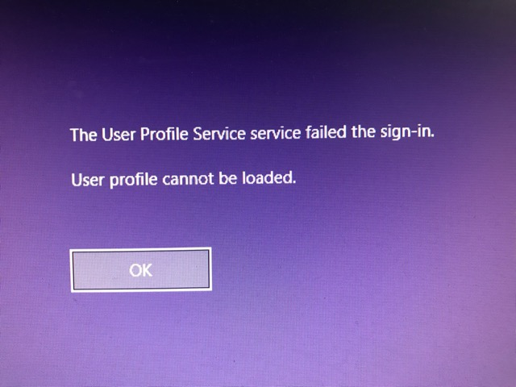
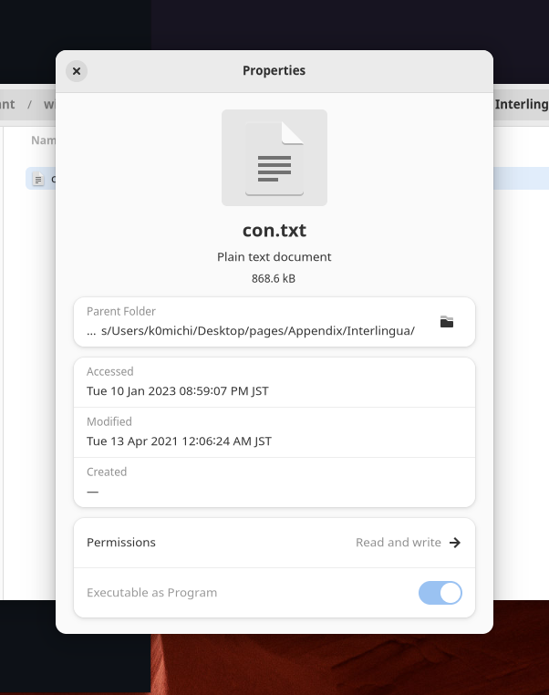

# Windows 10のリセットに失敗する問題と、その原因が判明

前に使っていたWindows 10デスクトップを初期化して綺麗にしようということで、Windowsのリセットを試みました。データを残してリセットすることもできるようですが、今回は全てのデータを削除するオプションを選択しました。リセットを始めてしばらく経つと、何故だかログインの画面が表示されていました。しかも、ユーザー名が残ったままだったのです。ログインしようとすると、このようなエラーが表示され、ログインすることすらできなくなりました。



何故こうなるのか、心当たりとしては、ユーザーのレジストリを弄ったことがあったので、それが原因かとも思いました。しかし、もうログインすることすらできないので、もうインストールメディアから再インストールするしか方法が無いように思いました。

ということで、再インストールをすることにしたのです。手元に再インストール用に使えるUSBメモリが無かったので、届くまでは他のことをしようということで、ふともう一つのドライブに入っているArch Linuxを起動しました。そして、LinuxからWindowsのドライブを見てみると、原因が明らかになりました。



このファイル(ともう一つ)だけが、使っていたユーザーのホームディレクトリ下に残っていたのです。おそらくWiktionaryのファイルの一つかと思います。Windowsでは、ファイルに付けられない名前というのがいくつかありますが、その一つがCONであるので、Windowsがこのファイルを消すことができず、リセットに失敗したのだと考えられます。もう一つのファイルも、同様にcon.txtという名前でした。Linux上からは問題なく消すことができるので、消してからやり直すと、問題なくWindowsをリセットすることができました。

因みに、Windowsにはこれ以外にも使えない名前が結構あります。公式のドキュメントに詳しく載っています。

- [ファイル、パス、および名前空間の名前付け - Win32 apps | Microsoft Learn](https://learn.microsoft.com/ja-jp/windows/win32/fileio/naming-a-file)

## なぜ存在できないはずのファイルがあったのか？

普通は、con.txtのようなファイルはWindowsでは作成できません。しかし、こういったWindowsで禁止されているファイル名を付けられてしまう場合があります。それは、WSL (Windows Subsystem for Linux)を使った場合です。

WSLでは、以下のような、Windowsでは禁止されているファイル名であっても、作成することができてしまうのです。
```bash
touch con.txt
```
しかし、こうして作られたファイルは、Windowsのエクスプローラーから消そうとすると、エラーとなって消すことができません。なお、WSL上からは消すことができます。

このように、わざと禁止されている名前でファイルを作成することはあまり考えられません。しかし、今回の私の場合のように、WSL上でアーカイブを展開するようなことをすると、もしその中にWindowsで扱えないファイルが存在していても、問題なく解凍することができてしまうのです。そして結果として、思わぬエラーを引き起こします。

得られた教訓としては、Windowsをよく知らずにWSLを使うべきではないということでしょうか。UNIX環境が欲しいのであれば、Windowsとは別で用意した方が賢明でしょう。

## 余談 Windowsの環境構築

- 自分用ルートディレクトリの作成

  Windowsでは特に、デスクトップやホームディレクトリに勝手にフォルダが増えていくので、自分のファイルを隔離するために作っておいた方が良いです。
- ブラウザのインストール
- グラフィックスカードのドライバのインストール
- Visual Studioのインストール
- Gitのインストール
- CMakeのインストール

  wingetからインストールすることができました。
- 各種設定

  拡張子の表示、マウス加速無効化など。