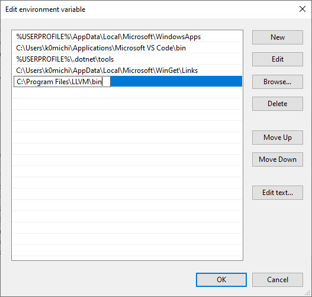
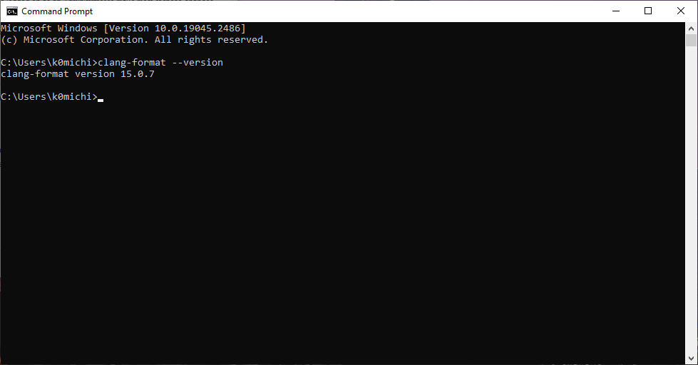

# Windowsでclang-formatを使う

Windowsでclang-formatを使う方法はいくつかあるかと思いますが、最も簡単なのは、wingetからLLVMごとインストールするという方法です。

wingetは既に入っていることが前提です。以下のコマンドで、LLVMをインストールします。

```
> winget install llvm
```

インストールしただけではパスが通っていないので、パスを通します。C:\Program Files\LLVM\binを環境変数Pathに追加します。



これで、コマンドプロンプトから使うことができるようになります。

