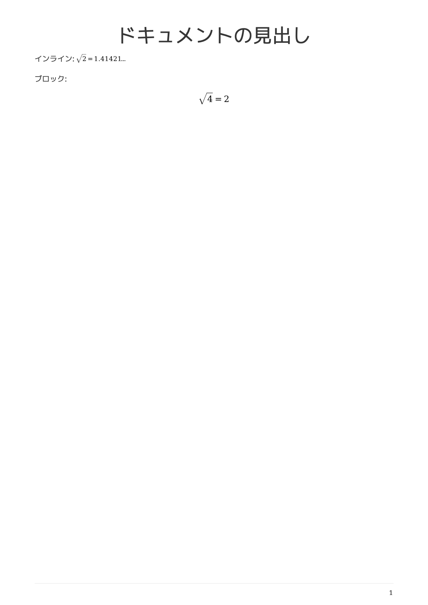

# M1 Macでもasciidoctor-mathematicalを使いたい【Docker】

以前の記事でAsciiDoctor PDFでasciidoctor-mathematicalを使い、数式を出力しようとしたのですが、どうしてもSegmentation faultとなって上手く動かすことができませんでした。エラーメッセージは以下のようなものです。

```
% asciidoctor-pdf -a pdf-theme=default-with-fallback-font -r asciidoctor-mathematical test.adoc
/opt/homebrew/lib/ruby/gems/3.2.0/gems/mathematical-1.6.14/lib/mathematical.rb:47: [BUG] Segmentation fault at 0x0000600052682438
ruby 3.2.0 (2022-12-25 revision a528908271) [arm64-darwin21]
...
```

この問題について少し調べたのですが、MathematicalのIssueとして似た現象が上がっていました。M1 Mac特有の問題のようです。
- [\`Segmentation fault at 0x000060002054cfb0\` on M1 Mac · Issue #108 · gjtorikian/mathematical](https://github.com/gjtorikian/mathematical/issues/108)

しかし、残念ながら直接的な解決策は今のところ何も無さそうです。しかしながら、その場しのぎ的な対処療法は存在します。Dockerを用いて、x86_64バージョンを動かせば良いのです。そして幸いなことに、Asciidoctor公式が[asciidoctor/docker-asciidoctor](https://github.com/asciidoctor/docker-asciidoctor)というDockerイメージを提供してくれています。

使い方はとても簡単です。asciidoctor/docker-asciidoctorをイメージ名に指定し、`-v`オプションでホスト側のディレクトリをマウントします。`-v ホストの絶対パス:コンテナ内の絶対パス`のように指定します。カレントディレクトリの絶対パスは環境変数`$PWD`に格納されているので、そこからの相対パスとして書くこともできます。

```
% docker run -it -v $PWD/adoc:/documents/ asciidoctor/docker-asciidoctor
WARNING: The requested image's platform (linux/amd64) does not match the detected host platform (linux/arm64/v8) and no specific platform was requested
85f99e41ac2b:/documents#
```

次の内容を`test2.adoc`として保存します。

```
= ドキュメントの見出し
:stem: latexmath

インライン: stem:[\sqrt{2} = 1.41421...]

ブロック:
[stem]
++++
\sqrt{4} = 2
++++
```

これをPDFに変換してみます。デフォルトの設定では、数式はPNG形式の画像として埋め込まれますが、拡大すると粗が目立ってしまうので、`-a mathematical-format=svg`でSVG形式に変更します。

```
# asciidoctor-pdf -a pdf-theme=default-with-fallback-font -a mathematical-format=svg -r asciidoctor-mathematical test2.adoc
```

以下のようなPDFが出力されます。日本語も正しく表示されています。



このように、Dockerとasciidoctor/docker-asciidoctorイメージを利用することで、M1 Macでもasciidoctor-mathematicalを動かすことができました。