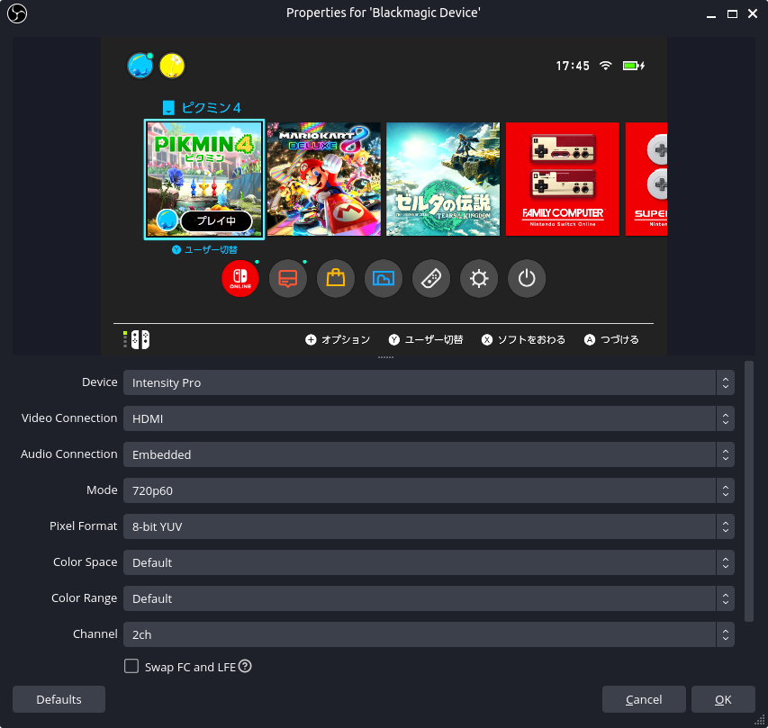

# UbuntuのOBSでBlackmagicのキャプチャーボードが認識されない問題

中古で購入したPCに、偶然にもBlackmagic DesignのIntensity Proが付属していたので、Ubuntu上のOBSで使おうとしたのだが、ソースとして認識されておらず使うことができなかった。ちなみにBlackmagicの公式ドライバはインストールしてあり、デバイス自体は認識されている。

調べてみたところ、どうやら、OBSをSnapからインストールしていることが原因のようだった。ということで、OBSを[PPA](https://launchpad.net/~obsproject/+archive/ubuntu/obs-studio)からインストールし直してみた。

```
$ sudo snap remove obs-studio
$ sudo add-apt-repository ppa:obsproject/obs-studio
$ sudo apt update
$ sudo apt install obs-studio
```

すると、"Blackmagic Device"がソースとして追加され、映像をキャプチャすることができた。今回はNintendo Switchの画面で試してみた。



Switchの画面をキャプチャする時の注意点としては、Modeを720p60にしないとキャプチャすることができない点である。デフォルトだと525iになっているので、何も表示されない。