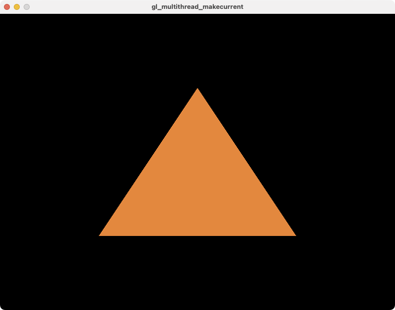

# OpenGLで、一つのコンテキストは複数のスレッドからmake currentできるか？

OpenGLにある程度詳しい人ならばご存知の通り、OpenGLのコンテキストは複数のスレッドから**同時に**make currentすることはできない。これについては、WGLやGLXのドキュメントにも記されているので、明らかなことである。

- [wglMakeCurrent function (wingdi.h) - Win32 apps | Microsoft Learn](https://learn.microsoft.com/en-us/windows/win32/api/wingdi/nf-wingdi-wglmakecurrent)
- [glxmakecurrent(3) - Linux man page](https://linux.die.net/man/3/glxmakecurrent)
- [OpenGL on the Mac Platform](https://developer.apple.com/library/archive/documentation/GraphicsImaging/Conceptual/OpenGL-MacProgGuide/opengl_pg_concepts/opengl_pg_concepts.html)
- [eglMakeCurrent - EGL Reference Pages](https://registry.khronos.org/EGL/sdk/docs/man/html/eglMakeCurrent.xhtml)

それに加えて、インターネット上では、OpenGLのコンテキストは、そのコンテキストが作成されたスレッドからしかmake currentすることはできない、という書き込みを至る所に見かける。しかしながら、私が調べた限りでは、このことについての情報が、APIのドキュメントなどといった公式の場所に書かれているのを見つけることができなかった。

そこで、ひょっとするとこれらのコンテキストを作成したスレッドからしかmake currentできないという情報は誤りで、コンテキストに対する同期さえとれば、複数のスレッドから一つのコンテキストを操作することができるのでは、と考えた。もしそうならば、DirectX 11のデバイスコンテキストに近い扱い方をすることができる。

## 実験

ということで、OpenGLのコンテキストは、本当に作成したスレッドからしかmake currentすることができないのかを、実際にプログラムを書いて調べてみた。今回は、私が使い慣れているSDLとgladを用いた。

```cpp
#include <iostream>
#include <mutex>
#include <thread>

#include <glad/gl.h>

#define SDL_MAIN_HANDLED
#include <SDL2/SDL.h>

// #define USE_GLES

struct GLContext {
  SDL_Window *window;
  SDL_GLContext context;
  std::mutex mutex;
};

void checkGLErrors() {
  GLenum error;

  while (error = glGetError(), error != GL_NO_ERROR) {
    const char *string;

    switch (error) {
    case GL_NO_ERROR:
      string = "GL_NO_ERROR";
      break;
    case GL_INVALID_ENUM:
      string = "GL_INVALID_ENUM";
      break;
    case GL_INVALID_VALUE:
      string = "GL_INVALID_VALUE";
      break;
    case GL_INVALID_OPERATION:
      string = "GL_INVALID_OPERATION";
      break;
    case GL_INVALID_FRAMEBUFFER_OPERATION:
      string = "GL_INVALID_FRAMEBUFFER_OPERATION";
      break;
    case GL_OUT_OF_MEMORY:
      string = "GL_OUT_OF_MEMORY";
      break;
    default:
      continue;
    }

    std::cout << string << std::endl;
  }
}

class GLContextLock {
private:
  GLContext *mContext;
  inline static std::thread::id lastThreadID;

public:
  GLContextLock(GLContext &context) : mContext(&context) {
    mContext->mutex.lock();
    SDL_GL_MakeCurrent(mContext->window, mContext->context);

    std::thread::id id = std::this_thread::get_id();

    if (id != lastThreadID) {
      std::cout << "MakeCurrent(" << mContext->window << ", "
                << mContext->context << "); Thread ID: " << id << std::endl;
      lastThreadID = id;
    }
  }

  ~GLContextLock() {
    checkGLErrors();
    SDL_GL_MakeCurrent(nullptr, nullptr);
    mContext->mutex.unlock();
  }

public:
  GLContextLock &operator=(const GLContextLock &) = delete;
};

GLContext createContext(SDL_Window *window) {
  SDL_GLContext context = SDL_GL_CreateContext(window);
  gladLoadGL((GLADloadfunc)SDL_GL_GetProcAddress);
  SDL_GL_MakeCurrent(nullptr, nullptr);
  return {window, context, {}};
}

void deleteContext(GLContext &context) {
  SDL_GL_DeleteContext(context.context);
}

GLuint vao;
GLuint vbo;
GLuint shaderProgram;

void initialize(GLContext &context) {
  GLContextLock lock(context);

  float vertices[] = {-0.5f, -0.5f, 0.5f, -0.5f, 0.0f, 0.5f};

  glGenVertexArrays(1, &vao);
  glBindVertexArray(vao);

  glGenBuffers(1, &vbo);
  glBindBuffer(GL_ARRAY_BUFFER, vbo);
  glBufferData(GL_ARRAY_BUFFER, sizeof(vertices), vertices, GL_STATIC_DRAW);

  const char *vertexShaderSource = R"(#version 330 core
    layout (location = 0) in vec2 aPos;
    void main() {
        gl_Position = vec4(aPos.x, aPos.y, 0.0, 1.0);
    })";

  const char *fragmentShaderSource = R"(#version 330 core
    out vec4 FragColor;
    void main() {
        FragColor = vec4(1.0, 0.5, 0.2, 1.0);
    })";

  GLuint vertexShader = glCreateShader(GL_VERTEX_SHADER);
  glShaderSource(vertexShader, 1, &vertexShaderSource, nullptr);
  glCompileShader(vertexShader);

  GLuint fragmentShader = glCreateShader(GL_FRAGMENT_SHADER);
  glShaderSource(fragmentShader, 1, &fragmentShaderSource, nullptr);
  glCompileShader(fragmentShader);

  shaderProgram = glCreateProgram();
  glAttachShader(shaderProgram, vertexShader);
  glAttachShader(shaderProgram, fragmentShader);
  glLinkProgram(shaderProgram);

  glVertexAttribPointer(0, 2, GL_FLOAT, GL_FALSE, 2 * sizeof(float), (void *)0);
  glEnableVertexAttribArray(0);
}

int main(int argv, char **args) {
  SDL_SetMainReady();
  SDL_Init(SDL_INIT_VIDEO);

  SDL_GL_SetAttribute(SDL_GL_DOUBLEBUFFER, 1);

#ifndef USE_GLES
  SDL_GL_SetAttribute(SDL_GL_CONTEXT_MAJOR_VERSION, 3);
  SDL_GL_SetAttribute(SDL_GL_CONTEXT_MINOR_VERSION, 3);
  SDL_GL_SetAttribute(SDL_GL_CONTEXT_PROFILE_MASK, SDL_GL_CONTEXT_PROFILE_CORE);
#else
  SDL_GL_SetAttribute(SDL_GL_CONTEXT_MAJOR_VERSION, 2);
  SDL_GL_SetAttribute(SDL_GL_CONTEXT_MINOR_VERSION, 0);
  SDL_GL_SetAttribute(SDL_GL_CONTEXT_PROFILE_MASK, SDL_GL_CONTEXT_PROFILE_ES);
#endif

  SDL_Window *window =
      SDL_CreateWindow("gl_multithread_makecurrent", SDL_WINDOWPOS_CENTERED,
                       SDL_WINDOWPOS_CENTERED, 800, 600, SDL_WINDOW_OPENGL);

  GLContext context = createContext(window);

  // Initialize resources in another thread...
  std::thread thread([&] { initialize(context); });
  thread.join();

  bool quit = false;
  while (!quit) {
    SDL_Event event;
    while (SDL_PollEvent(&event)) {
      if (event.type == SDL_QUIT) {
        quit = true;
      }
    }

    {
      GLContextLock lock(context);

      glClearColor(0.0f, 0.0f, 0.0f, 1.0f);
      glClear(GL_COLOR_BUFFER_BIT);

      glUseProgram(shaderProgram);

      glBindVertexArray(vao);
      glDrawArrays(GL_TRIANGLES, 0, 3);

      SDL_GL_SwapWindow(window);
    }
  }

  {
    GLContextLock lock(context);

    glDeleteVertexArrays(1, &vao);
    glDeleteBuffers(1, &vbo);
    glDeleteProgram(shaderProgram);
  }

  deleteContext(context);
  SDL_DestroyWindow(window);
  SDL_Quit();

  return 0;
}
```

ウィンドウとGLコンテキストを作成し、描画リソースの準備をもう一つのスレッドで行い、メインスレッドで描画を行う、という流れになっている。また、コンテキストは`std::mutex`を用いて、常に一つのスレッドだけがmake currentできるようにしてある。もし、GLコンテキストが作成されたスレッド以外からもmake currentすることができるならば、オレンジ色の三角形が描画されるはずである。

[k0michi/gl-multithread-makecurrent](https://github.com/k0michi/gl-multithread-makecurrent)に、CMakeLists.txtを含む完全なコードを置いてある。

## 結果

プログラムを実行した結果、オレンジ色の三角形が現れた。



つまり、コンテキストを作成していないスレッドからであっても、make currentしてコンテキストに対する操作をすることができた、ということになる。実行ログからも、別のスレッドから同じコンテキストがmake currentされていることが確認できる。

```
MakeCurrent(0x152f99a00, 0x154054460); Thread ID: 0x16d797000
MakeCurrent(0x152f99a00, 0x154054460); Thread ID: 0x1e57c5e00
```

実行にはApple M1 Proを搭載するMacBook Pro (2021)を用いた。加えて、NVIDIA GeForce GTX 1080を搭載するWindows PC、Intel Iris Pro搭載のMacBook Pro (Late 2013)でも同じ結果が得られた。

## 結論

少なくとも私が試した3つのPC上では、コンテキストを作成したスレッド上からしかmake currentできないなんてことはなく、普通に複数のスレッド上から操作することができた。

このことから、インターネット上に流布している、作成したスレッドからしかmake currentすることはできないという情報は、誤りではないかと思われる。勿論、特定の処理系やドライバによって、そうなっている可能性が全くないわけではないので、例外があったら教えて欲しいところである。

今回はSDLを用いたが、実はGLFWでは、ドキュメントに以下のような記載がある。

- [GLFW: Context guide](https://www.glfw.org/docs/latest/context_guide.html)

> When moving a context between threads, you must make it non-current on the old thread before making it current on the new one.

ということなので、少なくともGLFWでは完全に合法であり、おそらくSDLについても同様ではないかと思われる。