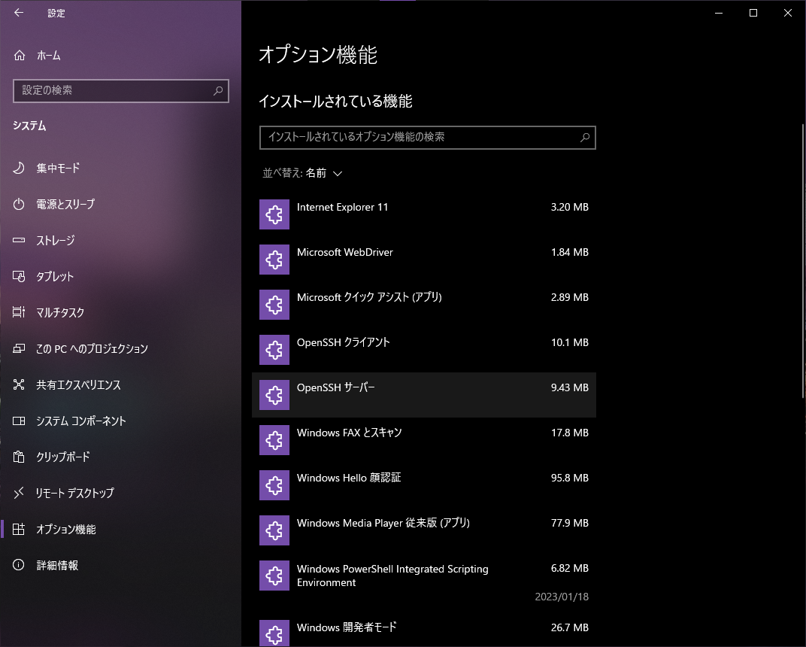
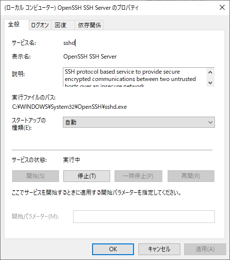
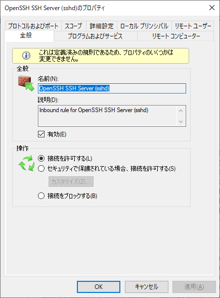

# Windows 10のSSHサーバーを有効にする

最近のWindowsには、SSHサーバーが公式で用意されているので、それを使えば比較的簡単にWindowsマシンをSSHサーバーにすることができる。基本的には[公式のドキュメント](https://learn.microsoft.com/ja-jp/windows-server/administration/openssh/openssh_install_firstuse)に従えば良いが、公開鍵認証の設定でハマったのでメモ。

## SSHサーバーをインストールする

「設定」の「オプション機能」から、「OpenSSH サーバー」をインストールする。自分の場合はすでに入っていた。



## SSHサーバーを有効化する

「サービス」を開いて"OpenSSH SSH Server"を有効化する。ついでにスタートアップ時に起動するようにしておく。



## ポートを解放する

「セキュリティが強化された Windows Defender ファイアウォール」(文字通り)を開き、TCP22番ポートを解放するのだが、これまたすでに設定が存在していたので、そのままで良い(インストール時に自動的に作られているのかもしれない)。



この時点で、`ssh username@xxx.xxx.xxx.xxx`とすると、パスワードによるログインが行えるはず。

## 公開鍵を配置する

すでに鍵ペアはクライアント上で作成していて、公開鍵が`~/.ssh/id_ecdsa.pub`にあると仮定する。`ssh-copy-id`だとうまくいかなかったので(管理者だからだろうか)、`scp`を使って公開鍵を送信する。

```
% scp ~/.ssh/id_ecdsa.pub username@xxx.xxx.xxx.xxx:~
```

これで、公開鍵がユーザーのホームディレクトリに転送される。

ここからが少し厄介。ログイン対象のユーザーが管理者なのか、そうでないのかで鍵を置く場所が異なる。

管理者ならば、鍵を`C:\ProgramData\ssh\administrators_authorized_keys`に配置する。

```
> type id_ecdsa.pub >> C:\ProgramData\ssh\administrators_authorized_keys
```

加えて、PowerShellを管理者モードで開き、

```
> icacls.exe "C:\ProgramData\ssh\administrators_authorized_keys" /inheritance:r /grant "Administrators:F" /grant "SYSTEM:F" 
```

を実行して`administrators_authorized_keys`のアクセス権を変更する。これを忘れると、公開鍵でログインすることができない。詳しくは[このページ](https://learn.microsoft.com/ja-jp/windows-server/administration/openssh/openssh_server_configuration)を参照。次回鍵を追加する場合には、管理者権限が必要となることに注意。

管理者でないならば、鍵を`C:\Users\(username)\.ssh\authorized_keys`に配置するだけでよい(はず。試していない)

```
> mkdir .ssh
> type id_ecdsa.pub >> .ssh\authorized_keys
```

## 公開鍵ログインを有効化し、パスワードロクインを無効化する

管理者権限でコマンドプロンプトを開き、`sshd_config`を編集する(エディタはなんでも良い)。

```
> nano C:\ProgramData\ssh\sshd_config
```

`PubkeyAuthentication`の行のコメントを外し、`PasswordAuthentication no`をその下に付け加える。

```
PubkeyAuthentication yes
PasswordAuthentication no
```

これで、無事公開鍵でログインが行えるはずである。

## 参考

- [Windows 用 OpenSSH の概要 | Microsoft Learn](https://learn.microsoft.com/ja-jp/windows-server/administration/openssh/openssh_install_firstuse)
- [Windows 用 OpenSSH でのキーベースの認証 | Microsoft Learn](https://learn.microsoft.com/ja-jp/windows-server/administration/openssh/openssh_keymanagement)
- [Windows 用 OpenSSH サーバーの構成 | Microsoft Learn](https://learn.microsoft.com/ja-jp/windows-server/administration/openssh/openssh_server_configuration)