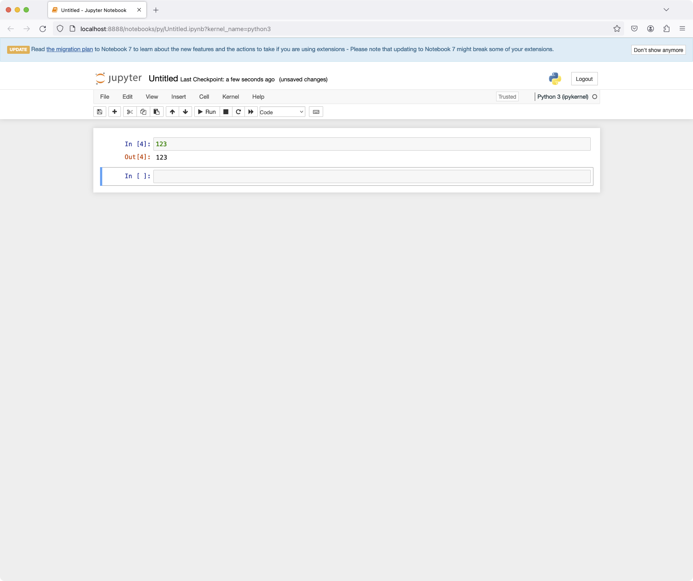

# Jupyter Notebookを起動しても空白のページしか表示されない問題 [macOS]

## 問題

Jupyter Notebookを使ってみるべく、`pip install jupyter`でインストールして、`jupyter notebook`で起動したのだが、次のようにまっさらなページしか表示されなかった。


コンソールのエラーメッセージ:

```
[W 2024-02-20 13:21:28.902 JupyterNotebookApp] Missing or misshapen translation settings schema:
    HTTP 404: Not Found (Schema not found: /opt/homebrew/Cellar/python@3.11/3.11.6/Frameworks/Python.framework/Versions/3.11/share/jupyter/lab/schemas/@jupyterlab/translation-extension/plugin.json)
[W 2024-02-20 13:21:28.903 JupyterNotebookApp] Settings directory does not exist at /opt/homebrew/Cellar/python@3.11/3.11.6/Frameworks/Python.framework/Versions/3.11/share/jupyter/lab/schemas
[W 2024-02-20 13:21:28.942 JupyterNotebookApp] Missing or misshapen translation settings schema:
    HTTP 404: Not Found (Schema not found: /opt/homebrew/Cellar/python@3.11/3.11.6/Frameworks/Python.framework/Versions/3.11/share/jupyter/lab/schemas/@jupyterlab/translation-extension/plugin.json)
[W 2024-02-20 13:21:28.942 ServerApp] 404 GET /lab/api/settings/@jupyter-notebook/application-extension:shell?1708402888939 (127.0.0.1): Schema not found: /opt/homebrew/Cellar/python@3.11/3.11.6/Frameworks/Python.framework/Versions/3.11/share/jupyter/lab/schemas/@jupyter-notebook/application-extension/shell.json
[W 2024-02-20 13:21:28.942 JupyterNotebookApp] wrote error: 'Schema not found: /opt/homebrew/Cellar/python@3.11/3.11.6/Frameworks/Python.framework/Versions/3.11/share/jupyter/lab/schemas/@jupyter-notebook/application-extension/shell.json'
    Traceback (most recent call last):
      File "/opt/homebrew/lib/python3.11/site-packages/tornado/web.py", line 1788, in _execute
        result = method(*self.path_args, **self.path_kwargs)
                 ^^^^^^^^^^^^^^^^^^^^^^^^^^^^^^^^^^^^^^^^^^^
      File "/opt/homebrew/lib/python3.11/site-packages/tornado/web.py", line 3301, in wrapper
        return method(self, *args, **kwargs)
               ^^^^^^^^^^^^^^^^^^^^^^^^^^^^^
      File "/opt/homebrew/lib/python3.11/site-packages/jupyterlab_server/settings_handler.py", line 57, in get
        result, warnings = get_settings(
                           ^^^^^^^^^^^^^
      File "/opt/homebrew/lib/python3.11/site-packages/jupyterlab_server/settings_utils.py", line 379, in get_settings
        schema, version = _get_schema(schemas_dir, schema_name, overrides, labextensions_path)
                          ^^^^^^^^^^^^^^^^^^^^^^^^^^^^^^^^^^^^^^^^^^^^^^^^^^^^^^^^^^^^^^^^^^^^
      File "/opt/homebrew/lib/python3.11/site-packages/jupyterlab_server/settings_utils.py", line 55, in _get_schema
        raise web.HTTPError(404, notfound_error % path)
    tornado.web.HTTPError: HTTP 404: Not Found (Schema not found: /opt/homebrew/Cellar/python@3.11/3.11.6/Frameworks/Python.framework/Versions/3.11/share/jupyter/lab/schemas/@jupyter-notebook/application-extension/shell.json)
```

## 環境

- MacBook Pro (2021, M1 Pro)
- macOS Ventura 13.6
- Python 3.11.6

## 解決法

ググってみると、同じ症状を見つけることができた:

- [python - Can't use Jupyter Notebook because of &quot;missing or misshapen translation settings schema&quot; - Stack Overflow](https://stackoverflow.com/questions/77010850/cant-use-jupyter-notebook-because-of-missing-or-misshapen-translation-settings)
- [Missing or misshapen translation settings schema · Issue #6974 · jupyter/notebook](https://github.com/jupyter/notebook/issues/6974)

JupyterLabを入れ直せばいいらしい。

```
% pip3 uninstall jupyterlab
% pip3 install jupyterlab
% jupyter lab build
% jupyter lab
% jupyter notebook
```

入れ直すと、無事に起動できた。コードも実行できている。

