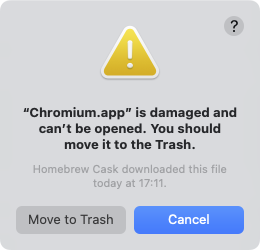

# Homebrew Caskで入れたアプリが破損していると言われ開けない問題

ChromiumやLibreWolfなどのアプリをHomebrew経由でインストールすると、次のようにアプリが破損しているというエラーが現れて、アプリが使用できない。Apple Siliconでのみ起きる、署名関連の問題らしい。



このエラーは、`brew install`時に`--no-quarantine`フラグを与えてインストールすることで回避できる。

```
% brew install chromium --no-quarantine
```

- [Homebrew - Chromium is damaged and can't be openend : r/MacOS](https://www.reddit.com/r/MacOS/comments/q9d772/homebrew_chromium_is_damaged_and_cant_be_openend/)
- [Frequently Asked Questions – LibreWolf](https://librewolf.net/docs/faq/#why-is-librewolf-marked-as-broken)